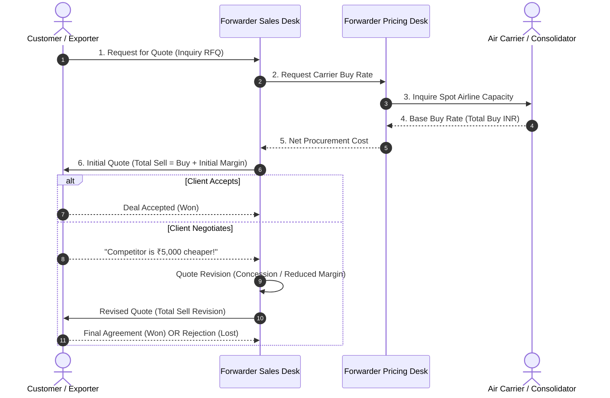
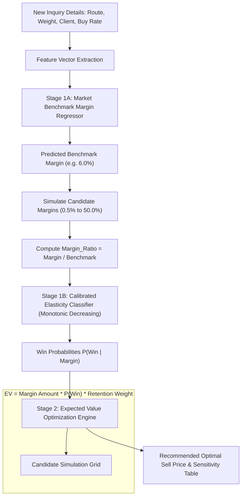

# Air Export Pricing & Profit Margin Recommendation Engine
## Comprehensive Project Reference & Preprocessing Documentation (v2.0)

**Input Dataset:** `Air & Ocean Inquiries (Air Export Pricing).xlsx`  
**Target Application:** Machine Learning Model for Recommending Optimal Profit Margins  
**Environment:** Python 3.9+ / Scikit-Learn 1.9.1 / Production Batch Pipeline  
**Model Version:** `v2.0-20260922`  

---

## Table of Contents
1. [Executive Summary & Dataset Context](#1-executive-summary--dataset-context)
2. [Dataset Schema & Column Relationships](#2-dataset-schema--column-relationships)
3. [Feature Identification: What to Keep vs. What to Eliminate](#3-feature-identification-what-to-keep-vs-what-to-eliminate)
4. [Duplicate Records, Negotiations & Status Interactions](#4-duplicate-records-negotiations--status-interactions)
5. [Audit of Edge Cases & Inconsistencies](#5-audit-of-edge-cases--inconsistencies)
6. [Survivorship Bias: Why We Must Learn from Failures](#6-survivorship-bias-why-we-must-learn-from-failures)
7. [Multi-Dimensional Margin Drivers (Beyond Base Rates)](#7-multi-dimensional-margin-drivers-beyond-base-rates)
8. [The Two-Stage Machine Learning Architecture](#8-the-two-stage-machine-learning-architecture)
9. [Data Pipeline Architecture & Execution Guide](#9-data-pipeline-architecture--execution-guide)
10. [Version 2.0 Production Enhancements & Audit Remediation](#10-version-20-production-enhancements--audit-remediation)

---

## 1. Executive Summary & Dataset Context

### What is this data about?
This dataset captures the **end-to-end commercial quoting and negotiation workflow** of an international freight forwarding company, primarily covering **Air Export shipments originating from India**.

### The Real-World Freight Quoting Process
In international logistics, freight forwarders do not own airplanes. Instead, they act as travel agents for cargo:
1. **Inquiry (RFQ):** A client requests a quote to move cargo (e.g., 500 kg from Delhi to London).
2. **Cost Procurement (`Total Buy`):** The forwarder's pricing desk queries airlines/consolidators for spot capacity rates.
3. **Quotation & Mark-up (`Total Sell`):** The sales team adds a commercial mark-up ($\text{Margin} = \text{Total Sell} - \text{Total Buy}$) and presents the quote to the client.
4. **Negotiation & Revisions:** If the client pushes back, the forwarder either renegotiates with the airline, reduces the profit margin, or offers alternative transit options. Each counter-offer generates a new quotation record.
5. **Outcome:** The client either accepts a quote (`Won`), chooses a competitor or cancels the shipment (`Lost`), or the quote remains under consideration (`Draft`).



---

## 2. Dataset Schema & Column Relationships

The raw inquiry records contain multiple relational identifiers and transactional metadata:
- **`Inquiry Number`:** Unique identifier of the shipment opportunity (RFQ). One inquiry can have multiple quotations.
- **`Quotation Number`:** Identifier of each commercial offer submitted to the client.
- **`Quote Status`:** The commercial outcome (`Won`, `Lost`, `Draft`, `Approved`, `Hold`, `Cancelled`).
- **`Total Buy` & `Total Sell`:** Procurement cost and quoted selling price in INR.
- **`Port of Loading` (POL) & `Port of Discharge` (POD):** Origin and destination airport facilities.
- **`Cargo Description`:** Goods type, determining density, handling, and commodity sensitivity.

---

## 3. Feature Identification: What to Keep vs. What to Eliminate

To prevent data leakage and guarantee inference validity:
- **Keep & Engineer:**
  - Shipment characteristics: `Chargeable_Weight_Kg`, `Gross_Weight_Kg`, `Cargo_Density_Ratio`, `Weight_Tier`.
  - Commercial profiles: `Business_Vertical`, `Commodity_Group`, `Company_Group`, `Incoterms`, `Booked by branch`.
  - Behavioral history: `Customer_Inquiry_Frequency`, `Customer_Tier`, `quote_revision_count`.
  - Geographic lane: `Origin_Port`, `Destination_Port`, `Origin_Region`, `Destination_Region`, `Regional_Lane`.
- **Eliminate (Data Leakage & Post-Hoc Fields):**
  - `Loss Reason`, `Loss Remarks`: Recorded only after quotation closes.
  - `TAT to Close`: Available only in post-mortem analysis.
  - `Total Sell`: Direct derivative of target variable during training.

---

## 4. Duplicate Records, Negotiations & Status Interactions

Inquiries with multiple quotations represent iterative negotiations.
- **Hierarchical Deduplication Priority:**
  $$\text{Won (1)} \succ \text{Approved (2)} \succ \text{Draft (3)} \succ \text{Lost (4)} \succ \text{Hold (5)} \succ \text{Cancelled (6)}$$
- If an inquiry was ultimately won, the winning quote is preserved.
- For lost or unclosed inquiries, the latest revised quotation is preserved to capture final counter-offers.
- Deduplication reduces raw records to 2,223 unique commercial inquiries.

---

## 5. Audit of Edge Cases & Inconsistencies

- **Multi-currency values:** Stripped of text labels (`INR`, `USD`, `EUR`) and parsed as float values.
- **Zero or negative margin errors:** Pruned non-commercial outliers ($<0.2\%$ or $>60.0\%$).
- **Volumetric weight vs gross weight:** Chargeable weight calculated as $\max(\text{Gross Weight}, \frac{L \times W \times H \times \text{Pcs}}{6000})$.

---

## 6. Survivorship Bias: Why We Must Learn from Failures

Fitting models strictly on won deals introduces critical survivorship bias:
1. It blinds the model to price points that clients rejected.
2. It fails on loss-only routes (such as Accra, Ghana, where all historical bids were lost).
3. Stage 1B Classifier requires both won and lost quotes to compute genuine win probability curves $P(\text{Win} \mid \text{Route}, \text{Weight}, \text{Margin})$.

---

## 7. Multi-Dimensional Margin Drivers (Beyond Base Rates)

Historical margins depend heavily on non-rate dimensions:
1. **Weight Tier Economies of Scale:** High volume shipments ($>1000$ kg) settle at $2.5\%–4.0\%$ margin, while light shipments ($<100$ kg) tolerate $12.0\%–25.0\%$.
2. **Account Frequency:** Key Accounts ($\ge 20$ inquiries/yr) command volume concessions, protected via account retention weighting.
3. **Commodity Sensitivity:** Perishables and Pharmaceuticals demand speed and reliability over discount pricing.

---

## 8. The Two-Stage Machine Learning Architecture



$$\text{Optimal Margin } M^* = \arg\max_{M} \Big[ M \times \text{Total Buy} \times P(\text{Win} \mid \text{Features}, M) \times \text{RetentionWeight} \Big]$$

---

## 9. Data Pipeline Architecture & Execution Guide

### Directory Organization
```
air_export_pricing_engine/
├── data/
│   ├── raw/
│   │   └── Air & Ocean Inquiries (Air Export Pricing).xlsx
│   └── processed/
│       ├── Air_Export_Pricing_Cleaned_ML.csv
│       └── Air_Export_Pricing_Won_Benchmark.csv
├── models/
│   └── freight_margin_recommender.joblib
├── scripts/
│   └── verify_vocab_alignment.py   # Automated CI verification gate
├── src/
│   ├── __init__.py
│   ├── constants.py               # Single source of truth for bounds & thresholds
│   ├── tiers.py                   # Centralized weight-tier & account-tier binning
│   ├── preprocess.py              # Canonical port normalization & commodity mapping
│   ├── train.py                   # Full-dataset encoder, 5-fold CV, calibration
│   ├── engine.py                  # Two-stage optimizer with parameterized guardrails
│   ├── db.py                      # SQLite history tracking & versioned migrations
│   └── app.py                     # Production web application & REST API
├── docs/
│   ├── AIR_EXPORT_PRICING_ML_DOCUMENTATION.md
│   └── evaluation_plots.png
├── requirements.txt
├── run.sh
└── README.md
```

### Execution Commands
```bash
./run.sh preprocess   # Clean and canonicalize raw inquiry data
./run.sh train        # Train Stage 1A regressor (5-fold CV) and Stage 1B classifier
./run.sh verify       # Verify that 100% of UI options map to trained encoder categories
./run.sh serve        # Launch web application on http://127.0.0.1:5050
./run.sh pipeline     # Execute complete pipeline end-to-end
```

---

## 10. Version 2.0 Production Enhancements & Audit Remediation

In response to the comprehensive codebase audit and team review, Version 2.0 addresses all 24 findings:

| Component | Finding Addressed | Remediation Implemented in v2.0 |
| :--- | :--- | :--- |
| **Categorical Alignment** | §2.1, §3.1, §3.3, §5.1 | Built canonical `PORT_ALIASES` and normalized commodity groups (`General Cargo`, `Perishable Foodstuff`, `Pharmaceuticals`, `Auto Parts`, `Garments / Textiles`, `Courier`, `Engineering & Machinery`, `Other`). Verified 58/58 UI dropdowns pass alignment with zero `-1` unknowns. |
| **Full-Dataset Encoding** | §1.1, §1.2 | Fitted `OrdinalEncoder` across all 2,223 inquiries (both won and lost). Preserved full loss signals for loss-only routes like Accra. |
| **Model Validation** | §1.5, §1.6, §2.5 | Implemented **5-fold cross-validation** for Stage 1A (MAE: 4.05%, RMSE: 7.30%, $R^2$: 0.51). Stage 1B calibrated ROC-AUC reached **0.895** with Brier score **0.116**. Verified negative monotonicity on `Margin_Ratio`. Added automated leakage assertion. |
| **Shared Constants** | §1.3, §2.2, §4.4 | Centralized margin bounds (`MIN_BENCHMARK_MARGIN = 1.0%`, `MAX_BENCHMARK_MARGIN = 48.0%`) in `constants.py` and weight-tier logic in `tiers.py`. |
| **Configurable Guardrails** | §4.1, §4.2, §4.3 | Refactored retention heuristics and dynamic probability floors into explicit `EngineConfig` and `RetentionGuardrailConfig` dataclasses. |
| **Input Validation** | §5.2, §5.3, §5.7 | Replaced text inputs with `type="number"` semantic fields. Added strict server-side validation returning structured HTTP 400 errors. Simplified `formatINR` to native `toLocaleString('en-IN')`. |
| **Audit DB Layer** | §6.1, §6.2, §6.3, §6.4 | Extracted database logic into modular `db.py`, enabled `PRAGMA user_version` migrations, recorded active `model_version`, and added all 11 operating branches to the UI. |
