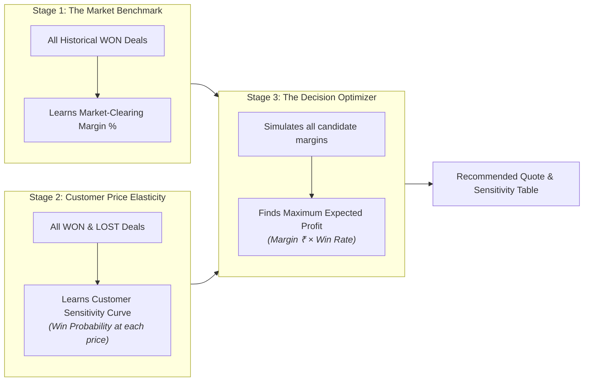
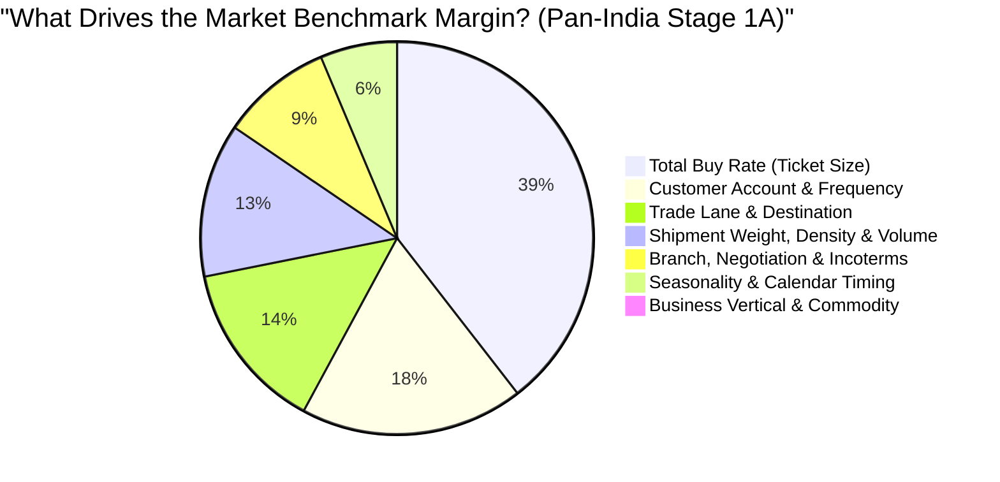

# Air Export Pricing Engine — Sales & Pricing Team Guide

**Document Version:** 2.3 (Remediated Enterprise Production Edition)  
**Target Audience:** Commercial Pricing Managers, Sales Executives, Branch Managers, and Key Account Teams  
**Published:** October 2026 (Remediated for Commercial Guardrails, Label Purity & Empirical Quantiles)  

---

## 1. What This Engine Is About

The **Air Export Pricing Engine** is an intelligent commercial assistant designed to help our sales and pricing teams quote the **most profitable, competitive sell rate** for every air export inquiry.

In air freight forwarding, setting the right margin is always a delicate balancing act:
- **Quote too high:** We lose the shipment to competing forwarders or direct airlines, earning ₹0 profit.
- **Quote too low:** We win the deal, but leave hard-earned money on the table, diluting branch profitability.
- **Treat everyone the same:** A 1-ton shipment for a top Key Account cannot be quoted with the same markup as a 10kg one-off parcel for an unknown walk-in customer.

This engine eliminates guesswork and manual pricing inconsistencies across branches. By analyzing thousands of our historical winning and lost quotes across all operating branch offices, the engine instantly calculates:
1. **The Market Benchmark Margin:** What margin typically clears in the market for this specific route, cargo weight, and airline cost.
2. **The Win Probability:** The realistic percentage chance that the customer will accept our quote at various price levels.
3. **The Recommended Commercial Quote:** The exact sweet spot that maximizes our total expected rupee profit while protecting customer relationships.
4. **Three Strategic Postures (Volume vs. Balanced vs. Premium):** Ready-to-use quotes calibrated for different commercial situations (e.g. filling block space agreements vs. peak season yield capture).

---

## 2. How We Used Past Data (Data Cleaning & Preparation)

The engine was built using our company's historical inquiry and quote records across our Pan-India branch network. However, raw commercial data is often noisy, containing test entries, duplicate quotes, and operational notes. To train a reliable model, we put the data through a rigorous cleaning process.

### A. How We Handled Duplicate Inquiries
In our daily business, a single customer inquiry (`Inquiry Number`) often goes through several updates:
- A salesperson might create a preliminary draft.
- The customer may ask for a revised rate, creating Revision 1 and Revision 2.
- The inquiry might go on hold before finally being marked as **Won** or **Lost**.

If we fed all these duplicates directly into the model, a single customer inquiry would be counted 3 or 4 times, confusing the engine.

**Our Deduplication Strategy:**
1. **Grouped by Inquiry:** We grouped all quotation entries by their unique `Inquiry Number`.
2. **Negotiation Intensity Tracking:** Before removing duplicates, we counted how many revisions occurred for that inquiry. We saved this as `quote_revision_count` because inquiries that require 2 or 3 revisions tell the model that the customer is actively bargaining.
3. **Hierarchical Outcome Priority:** When picking the single true outcome for an inquiry, we used a strict business priority hierarchy:
   $$\text{Won} \longrightarrow \text{Approved} \longrightarrow \text{Draft} \longrightarrow \text{Lost} \longrightarrow \text{Hold} \longrightarrow \text{Cancelled}$$
   - If an inquiry had a "Draft" and a "Won" quote, we kept the **Won** quote.
   - If an inquiry had multiple revisions that were eventually lost, we kept the **final revision** (the latest quote the customer rejected).
   
This scaled and deduplicated our historical multi-branch dataset down to **24,665 unique, high-integrity inquiries** (8,878 verified won deals and 15,787 lost inquiries) across all 11 operating Indian branch offices.

---

### B. Fields We Removed and Why

| Fields Removed | Why We Removed Them |
|:---|:---|
| **Future / Outcome Leaks**<br/>*(Loss Reason, Loss Remarks, TAT to Close, status_rank)* | These fields are filled in **after** a deal is finalized. When a sales rep sits down to quote a new customer today, nobody knows the future loss reason or closure turnaround time. If the model had access to these, it would cheat by looking at future answers rather than learning how to price. |
| **Operational & Personal Identifiers**<br/>*(Contact Names, Phone Numbers, Email IDs, Internal User IDs)* | Personal contact details add no commercial predictive value and represent privacy and compliance noise. |
| **Severe Anomalies & Test Bookings**<br/>*(Buy or Sell rates ≤ ₹500, or Sell < Buy)* | Entries under ₹500 were dummy system tests. Entries where Sell Price was lower than Buy Price were human data-entry errors (negative gross margins). Keeping them would teach the engine to lose money. |
| **Extreme Outliers**<br/>*(Margins > 60% or < 0.2%)* | Transactions where someone entered a 400% margin or 0.001% margin represent non-standard emergency charter flights or incorrect rate inputs that distort normal commercial freight pricing. |

---

### C. Fields We Kept and Why

Every field kept in the engine represents a critical commercial factor that pricing executives weigh every day:

| Field Kept | Plain-English Purpose | Why It Matters for Pricing |
|:---|:---|:---|
| **Total Buy Rate (INR)** | The baseline cost charged by the airline or consolidator. | Our baseline cost. Large-ticket shipments (e.g. ₹500,000) require lower percentage markups, while small shipments allow higher percentages. |
| **Chargeable & Gross Weight (Kg)** | The physical weight vs. volume weight of the cargo. | Airlines charge on whichever weight is higher. Weight directly dictates airline weight break brackets. |
| **Cargo Density Ratio** | Indicates whether cargo is light/bulky (volumetric) or heavy/compact. | Volumetric cargo takes up scarce aircraft hold volume and requires different commercial positioning than dense machinery. |
| **Weight Tier** | Standard industry brackets: `<45kg`, `45-100kg`, `100-300kg`, `300-500kg`, `500-1000kg`, `>1000kg`. | Airline rate cards and market competition change sharply between small parcels (<45kg) and heavy bulk cargo (>1000kg). |
| **Origin & Destination Ports** | 12 active Indian gateways (BOM, DEL, BLR, AMD, MAA, CCJ, COK, HYD, CNN, CCU, TRV, NMI) to 580+ global airports. | Captures exact lane dynamics, carrier flight frequencies, and airport handling factors across all international trade lanes. |
| **Regional Trade Lane** | Broader corridor (e.g., West India → Europe, North India → Middle East). | Ensures that even if a quote is for a lesser-known airport, the engine knows the broader regional capacity and supply-demand balance. |
| **Business Vertical** | Product category: *Air Export Forwarding*, *Air Perishable*, *Courier*, *Export Clearance*, or *General*. | Different verticals have completely different margins: urgent express courier commands higher margins than bulk general cargo. |
| **Commodity Group** | Standardized cargo type: *Pharma*, *Auto Parts*, *Perishables*, *Textiles*, *Machinery*, *General Cargo*, *Courier*, etc. | High-value, temperature-sensitive pharma shipments carry different margin sensitivity than garments or raw auto parts. |
| **Customer Company & Group** | Direct Shipper / Consignee, Freight Subagent, Overseas Agent, NVOCC / Coloader, GSA, or Customs Broker. | Direct shippers typically yield higher margins than co-loading subagents and GSAs who operate on tight margins. |
| **Customer Inquiry Frequency & Tier** | How often the customer requests quotes from us (Key Account vs. Regular vs. Occasional vs. Spot / One-Off). | Repeat, high-volume clients expect volume incentives and loyalty pricing. |
| **Booking Branch** | All 11 operating Indian branch offices (Mumbai, Delhi, Bangalore, Ahmedabad, Chennai, Calicut, Cochin, Hyderabad, Kannur, Kolkata, Trivandrum). | Captures regional buying power, local airline contracts, and branch-specific competitive environments. |
| **Incoterms** | Commercial trade terms: FOB, CIF, CFR, EXW, DAP/DDP. | Reflects how much freight risk and origin/destination handling is included in the forwarder's scope. |
| **Quote Revision Count** | How many times the quote was revised. | Captures negotiation intensity and price resistance from the customer. |
| **Air Cargo Season & Cyclical Time** | Quarter seasonality (*Q1 Slack/Fiscal Close*, *Q2 Perishable Peak*, *Q3 Monsoon MidYear*, *Q4 Holiday Rush*) and month-end push. | Dynamically adapts benchmark margins and win rates to airline capacity tightness throughout the fiscal year. |

---

## 3. How We Trained the Model

Instead of relying on a single formula, the engine uses an advanced **Two-Stage Machine Learning Process** that mirrors how an experienced Commercial Director thinks:



### Stage 1: Finding the "Market Benchmark"
- **The Question It Solves:** *"For this lane, weight bracket, and cargo type, what margin do winning deals normally close at in the open market?"*
- **How It Works:** We train a regressor exclusively on past **won deals**. It analyzes all shipment features (cost, weight, route, commodity) and predicts the fair market clearing margin (for example, `15.2%`).

### Stage 2: Understanding Customer "Price Elasticity"
- **The Question It Solves:** *"If we quote above or below that market benchmark, what is the realistic chance the customer says 'Yes'?"*
- **How It Works:** We train a classifier on **both won and lost inquiries**. It learns how customers react to different markups.
- **Economic Reality Rule:** The model enforces a strict common-sense rule: **As our quote becomes more expensive relative to the market benchmark, the win probability must strictly go down.** The model is mathematically forbidden from pretending that a higher price increases the win rate.
- **Calibration:** We calibrated the probabilities so that if the engine says a quote has an "80% win probability", roughly 8 out of 10 similar real-world quotes actually convert to wins.

---

## 4. The Weightage Assigned to Each Input

When calculating a quote, not all inputs carry equal weight. Here is the plain-English breakdown of how much influence each factor has based on our Pan-India production model:



### 1. Total Buy Rate (Cost Anchor) — ~39% Weight
- **The primary baseline cost anchor.** Air freight markups follow an inverse sliding scale:
  - On a ₹10,000 shipment, a 30% margin is standard and accepted by shippers (adding ₹3,000).
  - On a ₹500,000 shipment, a 30% margin would add an unacceptable ₹150,000 markup! Market reality forces large shipments into tighter 5%–15% margins.

### 2. Customer Relationship & Frequency — ~18% Weight
- **Significantly amplified across the Pan-India network (up from 8% in the pilot).**
  - High-frequency repeat shippers (`Key Accounts` quoting >15 times/yr) command competitive volume incentives to secure long-term account retention and customer lifetime value (LTV).
  - Walk-in spot shippers and one-off subagents receive standard market clearing markups.

### 3. Trade Lane, Origin & Destination — ~14% Weight
- Captures liquidity and carrier competition across 12 Indian gateways and 580+ international destination hubs:
  - High-frequency competitive trunk corridors (e.g. Mumbai/Delhi to Dubai, London, Frankfurt) have tighter clearing margins.
  - Secondary or long-haul destinations with constrained carrier space (e.g. Latin America, secondary African ports) command higher margins.

### 4. Shipment Weight, Density & Volume — ~13% Weight
- **Dense vs. Volumetric cargo dynamics:**
  - Heavy bulk cargo (>1,000kg) triggers lower percentage markups due to airline volume breaks and forwarder co-loading competition.
  - Small parcels (<45kg) and volumetric cargo carry higher percentage markups to offset fixed origin handling and document issuance costs per kilo.

### 5. Branch Office, Negotiation & Incoterms — ~9% Weight
- **Regional branch procurement differences:** Captures local airline contracts, BSA commitments, and market variations across all 11 branch offices (e.g. Delhi and Mumbai vs Bangalore, Ahmedabad, Chennai, and Calicut).
- **Quote revisions:** Captures active bargaining intensity and price resistance from prior quotation attempts.

### 6. Macro Seasonality & Calendar Timing — ~6% Weight
- Dynamically flexes margins according to the air freight cycle:
  - **Q1 Slack & Fiscal Close:** Tighter margins to stimulate cargo volume and meet annual airline tier commitments.
  - **Q2 Perishable Peak & Q4 Holiday Rush:** Elevated clearing margins as airline hold space tightens.
  - **Month-End Push:** Captures end-of-month volume surges and branch quota targets.

---

### What Drives Customer Win Probability (Stage 1B)?

While **Airline Buy Cost** and **Customer LTV** anchor the baseline margin (Stage 1A), what actually determines whether a customer **accepts or rejects** the quote in Stage 1B is driven by four key operational factors:

1. **Quote Revision Count (30.1%):** The single biggest predictor of win rate. Inquiries undergoing 2 or 3 revisions signal severe price sensitivity; conversion drops sharply unless rates are closely aligned with market reality.
2. **Booking Branch Responsiveness (16.7%):** Win conversion rates vary noticeably by branch execution, local relationship depth, and carrier allocations.
3. **Route Corridors & Origin (19.5% combined):** Route liquidity and the availability of direct vs transshipment carrier options determine how easily a customer can shop around.
4. **Month Cyclicality (14.3% combined):** Shippers are far more price-tolerant during peak season crunches when aircraft space is scarce than during slack quarters.

---

## 5. How the Engine Recommends the Margin

Once the engine knows the **Market Benchmark** (Stage 1) and the **Customer Win Probability Curve** (Stage 2), how does it pick the final winning number?

### A. The "Expected Profit" Formula (The Sweet Spot)
The engine does not simply quote the highest margin, nor does it blindly slash prices to win every deal. Instead, it maximizes **Expected Value (Total Expected Rupee Profit)**:

$$\text{Expected Profit} = \text{Margin Amount (₹)} \times \text{Probability of Winning}$$

Let's look at a simple real-world comparison for a ₹100,000 shipment:

| Strategy | Quoted Margin | Quoted Profit | Win Probability | Expected Rupee Profit | Outcome Assessment |
|:---|:---:|:---:|:---:|:---:|:---|
| **Price Slasher** | 5% | ₹5,000 | 95% | **₹4,750** | We win easily, but leave money on the table. |
| **Engine Sweet Spot** | **18%** | **₹18,000** | **70%** | **₹12,600** | **Optimal! Produces highest overall profit.** |
| **Greedy Skimmer** | 40% | ₹40,000 | 10% | **₹4,000** | Huge profit on paper, but we almost always lose the deal. |

The engine automatically selects the margin that yields the **₹12,600 sweet spot**.

---

### B. The Key Account Retention Safeguard
One of the most important rules built into the engine is **Account Retention Protection**:
- In B2B freight forwarding, losing a Key Account who ships 30 times a year because of one greedy quote is a disaster for company revenue.
- Whenever the customer has high transaction frequency (`Customer_Inquiry_Frequency > 15`), the engine **automatically dampens extreme margins**.
- Even if the mathematical optimizer sees a tempting one-time profit at a 25% margin, the retention safeguard caps and penalizes excessive markups, protecting the long-term customer relationship while keeping the quote highly profitable.

---

### C. The Margin Sensitivity Table: Giving Sales Reps Complete Visibility
The engine does not force sales reps into a black box. In the results panel, it generates a complete **Margin Sensitivity Table**:

```
Margin %  | Quoted Sell Rate | Gross Margin (₹) | Win Probability | Expected Value
-----------------------------------------------------------------------------------
 10.0%    | ₹110,000         | ₹10,000          | 92%             | ₹9,200
 15.0%    | ₹115,000         | ₹15,000          | 84%             | ₹12,600
 19.1% ★  | ₹119,100         | ₹19,100          | 72%             | ₹13,752  <-- RECOMMENDED OPTIMAL
 25.0%    | ₹125,000         | ₹25,000          | 45%             | ₹11,250
 30.0%    | ₹130,000         | ₹30,000          | 22%             | ₹6,600
```

- **If the sales rep needs volume:** They can glance at the table and see: *"If I lower my margin from 19.1% to 15.0%, my win rate jumps from 72% to 84%."*
- **If capacity is constrained (Peak Season):** *"If airline capacity is full, I can quote 25.0% and still maintain a 45% win chance."*

---

### D. The Three Interactive Commercial Postures (Decision Cards)

To make quotation effortless during rapid sales conversations, the results panel presents **Three Pre-Calibrated Commercial Posture Cards**. Clicking any card instantly updates the quote summary and highlights the exact corresponding row in the sensitivity table:

```
+-----------------------------------+-----------------------------------+-----------------------------------+
|      1. Floor (Volume Capture)    |       2. Balanced (Target)        |      3. Premium (Yield Skimmer)   |
|   Win Rate Floor: >= 40% (Growth) |   Win Rate Floor: >= 25% (Sweet)  |   Win Rate Floor: >= 15% (Yield)  |
|                                   |                                   |                                   |
|   - Low-margin, high-conversion   |   - Mathematical EV Maximum       |   - High-yield, selective quota   |
|   - Fills Block Space Agreements  |   - Default commercial sweet spot |   - Peak season capacity crunches |
|   - Protects airline allocations  |   - Balanced rupee profitability  |   - Specialized / urgent cargo    |
+-----------------------------------+-----------------------------------+-----------------------------------+
```

1. **Floor (Volume Capture) — Min 40% Win Rate:**
   - **Commercial Purpose:** Locks in deal conversion. Perfect when our branch holds an airline Block Space Agreement (BSA) with unutilized pallets that must be filled to avoid dead-freight penalties, or when bidding for high-volume new contract business.
2. **Balanced (Target / Optimal EV) — Min 25% Win Rate:**
   - **Commercial Purpose:** The standard operating sweet spot. Maximizes total rupee profit $\text{EV} = \text{Margin Amount (₹)} \times P(\text{Win})$. This is the default recommendation selected on every run.
3. **Premium (Margin Maximizer / Skimmer) — Min 15% Win Rate:**
   - **Commercial Purpose:** Captures elevated margins. Ideal during Q4 peak season capacity crunches, charter flights, holiday bottlenecks, or urgent temperature-controlled pharma consignments where carrier space is scarce and shippers are price-inelastic.

---

## 6. Summary Checklist for Sales & Pricing Teams

1. **Enter accurate cargo dimensions & weight:** Correct box dimensions ensure the system accurately calculates density ratios and applies proper volumetric weight break pricing.
2. **Search origin & destination ports:** Use the searchable airport selector across all 12 Indian export gateways and 580+ international destination hubs worldwide.
3. **Set realistic Customer Frequency:** Identifying Key Accounts ($>15$ inquiries/yr) activates the retention protection safeguard, automatically preventing excessive margins from damaging account loyalty.
4. **Select the Commercial Posture matching current capacity:**
   - Use **Floor** if you need guaranteed volume to fulfill carrier BSA allocations.
   - Use **Balanced** as your primary default for maximum overall profit.
   - Use **Premium** when space is tight or cargo requires urgent dedicated handling.
5. **Leverage the Sensitivity Table during negotiations:** Keep the sensitivity rows open during live phone negotiations to instantly quote counter-offers with exact visibility into your conversion probability.

---

## 7. Enterprise Commercial Guardrails & Remediated Architecture (v2.3)

In Version 2.3, the pricing engine was enhanced with non-negotiable freight-forwarding operational guardrails:

### A. Non-Negotiable Operational Cost Floors
Every generated quotation enforces a strict physical cost floor:
$$\text{Cost Floor Price} = \max\Big(\text{Airline Buy} \times (1 + \text{Min \%} + \text{Risk Buffer}) + \text{Ops Fee}, \quad \text{Airline Buy} + \text{₹1,500/AWB} + (\text{₹3/kg} \times \text{Chargeable Wt})\Big)$$
- **₹1,500 per AWB Minimum Contribution:** Prevents unprofitable micro-margins on small-weight consignments (<100kg).
- **₹3.00 per kg Operational Floor:** Covers physical warehouse handling, terminal cartage, and doc turnover.
- **₹850 Baseline Origin Documentation & Screening Fee:** Recovers fixed airport handling expenses.
- **Commodity Risk Buffers:** Automatically added for special handling (+6.0% Dangerous Goods, +4.0% Pharmaceuticals, +3.5% Perishables, +5.0% Valuables).

### B. IATA Physics & Weight-Break Arbitrage
- **Strict IATA Physics:** Chargeable weight is always $\ge$ Gross Weight and Volumetric Weight ($\text{Length} \times \text{Width} \times \text{Height} / 6000$), with standard commercial 0.5 kg ceiling increments.
- **Weight-Break Arbitrage Detection:** The engine automatically detects when declaring a higher weight break (e.g., billing 98 kg as 100 kg at a lower slab rate) lowers the client's total bill, protecting clients and securing freight commitments.

### C. Honest Win Probability & Empirical Cohort Quantiles
- **Out-of-Fold (OOF) Benchmark Modeling:** The classifier learns price elasticity using honest 5-fold cross-validated benchmark margins without data leakage or artificial logit shaping.
- **Empirical Cohort Anchoring:** Strategy tiers are anchored against historical won-deal margin quantiles (P25, P50, P75, P90) computed by trade corridor, weight slab, and commodity group.
- **Strict Strategy Distinctness:** The 3 strategic recommendation tiers are guaranteed to be distinct and strictly ordered:
  $$\text{Floor Quoted Price} < \text{Balanced Quoted Price} < \text{Premium Quoted Price}$$
  with active win-rate gating ($P(\text{Win}) \ge 40\%$ for Floor, $\ge 25\%$ for Balanced, $\ge 15\%$ for Premium).

### D. Audit Logging & Preset Isolation
- All generated quotations are persisted to an audit store (`recommendations_history.db`) recording route, buy cost, quoted sell, margin percentage, win probability, customer name, and inquiry reference.
- Quick test presets are tagged with `is_preset = 1` and excluded from management KPI conversion reports, preserving business intelligence integrity.
- Quote lifecycle updates (`Won`, `Lost`, `Negotiating`, `Draft / Quoted`) allow the team to track real quote-to-booking conversions over time.

### E. Upfront Category & Commodity Maximum Margin Ceilings
In air freight forwarding, different commodities and client accounts operate within well-defined commercial margin limits. Quoting above these market ceilings results in immediate deal loss:
- **Upfront Pre-Check:** Before candidate margins are generated or ML models are evaluated, the engine checks the maximum margin cap for both the **Commodity Type** and the **Client Category**:
  $$\text{Effective Max Margin Cap} = \min\big(\text{Commodity Max Cap}, \text{Client Category Max Cap}\big)$$
- **Standard Commodity Ceilings:**
  - *Auto Parts / Machinery Components:* **22.0%** (highly price-sensitive supply chain)
  - *Garments / Textiles / Apparel:* **25.0%** (fast fashion, high volume, competitive forwarder market)
  - *Engineering Goods & Industrial Hardware:* **25.0%**
  - *Perishable Foodstuff (Fruit / Veg / Fish):* **26.0%** (tight airline hold margins and spoilage sensitivity)
  - *General Cargo:* **30.0%** (standard freight baseline)
  - *Pharmaceuticals & Healthcare:* **35.0%** (validated GDP passive cooling packaging)
  - *Courier & Express Packages:* **38.0%** (urgent small packages)
  - *Dangerous Goods / Hazmat:* **42.0%** (IATA DGR segregation and hazardous liability)
  - *Valuable Cargo (VUN):* **45.0%** (tarmac armed escort and strongroom vaulting)
- **Client Category Ceilings:**
  - *Direct Shipper / Consignee:* **35.0%** (highest margin tolerance)
  - *Subagent / Forwarder Broker:* **28.0%**
  - *Customs Broker / CHA:* **25.0%**
  - *Overseas Agent:* **24.0%** (reciprocal net freight agreements)
  - *NVOCC / Co-loader:* **22.0%** (consolidators operating on tight wholesale margins)
  - *Transporter / Fleet:* **22.0%**
  - *General Sales Agent (GSA):* **20.0%**
  - *Shipping Line:* **18.0%**
- **Strict Bounding Invariant:** Every candidate row in the sensitivity table and all three strategic recommendation tiers (`Floor < Balanced < Premium`) are strictly bounded by $\text{Effective Max Margin Cap}$. If a quote hits the ceiling, a **Ceiling Reached** badge is displayed to alert sales executives that the maximum acceptable commercial margin for that cargo type has been achieved.

