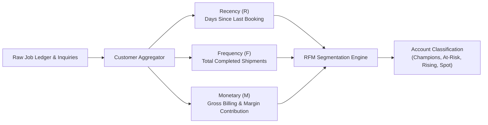
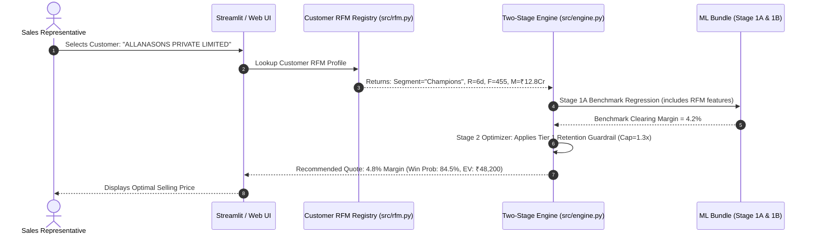

# Customer Segmentation & Dynamic RFM Engagement Architecture
## Strategic Blueprint & Implementation Specification for Air Export Pricing

**Document Version:** 1.0  
**Target Application:** Enterprise Air Export Dynamic Margin Recommender  
**Target Environment:** Python 3.9+ / Scikit-Learn 1.9.1 / SQLite / FastAPI / Streamlit  
**Module Integration:** `src/rfm.py`, `src/engine.py`, `src/preprocess.py`, `src/train.py`  

---

## Table of Contents
1. [Executive Summary & Strategic Objective](#1-executive-summary--strategic-objective)
2. [The Frequency-Only Blind Spot in Current Operations](#2-the-frequency-only-blind-spot-in-current-operations)
3. [Air Freight RFM Metric Definitions](#3-air-freight-rfm-metric-definitions)
4. [The 5-Tier Commercial Customer Segmentation Matrix](#4-the-5-tier-commercial-customer-segmentation-matrix)
5. [Integration with the Two-Stage Machine Learning Pipeline](#5-integration-with-the-two-stage-machine-learning-pipeline)
6. [Operational Edge Cases & Logistics-Specific Traps](#6-operational-edge-cases--logistics-specific-traps)
7. [Enterprise Safeguards & Governance Rules](#7-enterprise-safeguards--governance-rules)
8. [Phased Implementation Roadmap & Engineering Contracts](#8-phased-implementation-roadmap--engineering-contracts)

---

## 1. Executive Summary & Strategic Objective

In modern air freight forwarding, pricing decisions cannot be made solely on route distance and cargo weight. A quote is not just a transaction; it is an interaction within a **Customer Lifetime Value (LTV)** lifecycle.

The objective of this initiative is to elevate the existing **Air Export Pricing Engine** from a purely cargo-centric calculator to an **Account-Aware Dynamic Yield Optimization Platform**. By augmenting the current inquiry frequency counter with **Recency ($R$)** and **Monetary Spend ($M$)**, the system gains the intelligence to:
* **Protect Core Volume:** Guard against margin gouging on top-spending champion accounts.
* **Detect Silent Churn Early:** Identify former high-value accounts that are slipping away and automatically deploy targeted **"Win-Back" pricing**.
* **Extract Value from Transients:** Maximize profitability on infrequent, price-insensitive spot rate-shoppers who exhibit zero brand loyalty.
* **Maintain Zero Sales Friction:** Execute all segmentation and lookups in sub-milliseconds behind the scenes, requiring **zero extra form fields or manual data entry** from sales representatives.

---

## 2. The Frequency-Only Blind Spot in Current Operations

Currently, the pricing engine segments clients using a single scalar feature: `Customer_Inquiry_Frequency`, binned into four static categories (`Key Account`, `Regular`, `Occasional`, `Spot / One-Off`) via [`src/tiers.py`](file:///Users/deepak/Downloads/air_export_pricing_engine/src/tiers.py).

While effective as a baseline, measuring **Frequency ($F$) alone introduces two critical commercial blind spots**:

```
                       CURRENT FREQUENCY-ONLY PARADOX
   
   Client A: Booked 30 times (Mar–May) ──> Silent for 90 days  ──┐
                                                                 ├──> Treated IDENTICALLY
   Client B: Booked 30 times (Steady)  ──> Shipped yesterday    ──┘    as "Key Accounts"
   
   Client X: 20 Small Courier Parcels  ──> Spend: ₹1.5 Lakhs   ──┐
                                                                 ├──> Treated IDENTICALLY
   Client Y: 20 Chartered Cargo Planes ──> Spend: ₹3.0 Crores  ──┘    as "Regular Accounts"
```

1. **The "Ghost Account" Blind Spot (Missing Recency $R$):**
   * A former key account that has stopped booking for over 60–90 days is actively churning to a competitor. 
   * When they finally send an inquiry, treating them as an ordinary "Key Account" misses the vital commercial opportunity to quote an aggressive **Win-Back concession** to rescue the relationship.
2. **The "Ticket Size" Blind Spot (Missing Monetary $M$):**
   * A client booking 15 small parcel shipments totaling ₹1.2 Lakhs has vastly different commercial leverage, working capital requirements, and airline negotiation power than an enterprise account booking 15 heavy-pallet shipments totaling ₹1.8 Crores.
   * Grouping them together ignores capital exposure and airline Block Space Agreement (BSA) economics.

---

## 3. Air Freight RFM Metric Definitions

RFM metrics must be specifically adapted to the rhythms of international freight logistics:



### 3.1. Recency ($R$)
* **Definition:** Elapsed calendar days between the inquiry date ($t_{\text{inquiry}}$) and the client's most recent executed booking ($t_{\text{last\_booked}}$):
  $$R = \max\left(0, (t_{\text{inquiry}} - t_{\text{last\_booked}}).\text{days}\right)$$
* **Logistics Interpretation:**
  * $R \le 21\text{ days}$: **Active / Hot** (Normal operational rhythm for active exporters).
  * $22 \le R \le 60\text{ days}$: **Warm / Cooling** (Standard spot cycle or bi-weekly shipper).
  * $61 \le R \le 120\text{ days}$: **Cold / Slipping** (Abnormal gap for regular exporters; indicator of competitor trial).
  * $R > 120\text{ days}$: **Dormant / Inactive** (Lost account or rare seasonal shipper).

### 3.2. Frequency ($F$)
* **Definition:** Total count of completed, executed air export shipments within a trailing 180-day rolling evaluation window:
  $$F = \sum_{i \in \text{Jobs}_{180d}} \mathbb{I}(\text{Status}_i = \text{'Executed'})$$
* **Logistics Interpretation:**
  * $F \ge 25$: **Enterprise Fleet / High-Frequency** (Daily/Weekly regular cargo).
  * $10 \le F \le 24$: **Regular Commercial Shipper** (Consistent bi-weekly bookings).
  * $3 \le F \le 9$: **Occasional Shipper** (Ad-hoc project or monthly exporter).
  * $F \le 2$: **Spot / One-Off** (Single transactional rate-shopper).

### 3.3. Monetary Spend ($M$)
* **Definition:** Cumulative gross billing (`Total_Sell_INR`) generated by the account over the trailing 180-day rolling window:
  $$M = \sum_{i \in \text{Jobs}_{180d}} \text{Total\_Sell\_INR}_i$$
* **Logistics Interpretation:**
  * $M \ge ₹10,000,000$ (₹1 Crore+): **Tier 1 Strategic Enterprise** (Massive carrier volume leverage).
  * $₹2,500,000 \le M < ₹10,000,000$ (₹25L–₹1Cr): **Tier 2 Commercial Key Account**.
  * $₹500,000 \le M < ₹2,500,000$ (₹5L–₹25L): **Tier 3 Mid-Market Shipper**.
  * $M < ₹500,000$ (< ₹5L): **Tier 4 Small Parcel / Ad-hoc Account**.

---

## 4. The 5-Tier Commercial Customer Segmentation Matrix

By cross-referencing $R$, $F$, and $M$, every account is assigned one of **five discrete commercial operational profiles**:

| Segment Tier | Profile Attributes | Commercial Status | Prescribed Pricing Posture | Target Margin | Target Win Rate |
| :--- | :--- | :--- | :--- | :---: | :---: |
| **Tier 1: Champions** | Low $R$ ($<30$d)<br>High $F$ ($\ge 20$)<br>High $M$ ($>₹50\text{L}$) | **Core Enterprise Base Load.** Sustains airline BSA commitments. Dependable cash flow. | **LTV Retention & Defense.** Strictly limit markups. Never risk relationship defect over a 1% price spike. | **4.0% – 6.5%** | **80% – 92%** |
| **Tier 2: At-Risk Enterprise** | High $R$ ($>45$d)<br>High $F$ ($\ge 15$)<br>High $M$ ($>₹30\text{L}$) | **Slipping Strategic Account.** Formerly vital client going silent. Diverting bookings to rival forwarders. | **Aggressive Win-Back.** Slash margins to bare minimum to regain freight allocation before permanent churn. | **3.0% – 4.5%** | **70% – 85%** |
| **Tier 3: Rising Potentials** | Low $R$ ($<30$d)<br>Mid $F$ ($5\text{--}19$)<br>Growing $M$ ($₹10\text{L}\text{--}₹40\text{L}$) | **Growth Accounts.** Increasing cadence. Testing our service against incumbent providers. | **Nurture & Expand.** Highly competitive pricing designed to capture 100% wallet share. | **6.0% – 8.5%** | **60% – 75%** |
| **Tier 4: Steady Regulars** | Mid $R$ ($30\text{--}75$d)<br>Mid $F$ ($3\text{--}10$)<br>Mid $M$ ($<₹20\text{L}$) | **Standard Transactional Exporters.** Predictable flow with normal price sensitivity. | **Balanced Profit Maximization.** Standard algorithmically optimized expected profit ($EV$). | **8.5% – 13.0%** | **40% – 55%** |
| **Tier 5: Spot Rate-Shoppers** | High $R$ ($>90$d)<br>Low $F$ ($1\text{--}2$)<br>Low $M$ ($<₹5\text{L}$) | **Opportunistic Shoppers.** No loyalty. Blasting RFQs to 5 forwarders simultaneously. | **Maximum Margin Extraction.** Charge full market value. High margin if won; zero regret if lost. | **16.0% – 25.0%** | **20% – 35%** |

---

## 5. Integration with the Two-Stage Machine Learning Pipeline



### 5.1. Enhancements to Stage 1A (Market Benchmark Regressor)
* **New Continuous Features Added to Regressor:**
  * `Customer_Spend_Trailing_180d_INR` (Monetary intensity).
  * `Customer_Recency_Days` (Engagement freshness).
  * `Customer_RFM_Segment` (Categorical variable encoded via `OrdinalEncoder`).
* **Expected Effect:** Captures account-level purchasing power, recognizing that enterprise champions clear at lower benchmark margins than ad-hoc spot walk-ins.

### 5.2. Enhancements to Stage 1B (Calibrated Elasticity Classifier)
* **Elasticity Modulation:**
  Price sensitivity is not uniform across segments. Spot shippers drop conversion sharply when margins exceed 12%, whereas Champions tolerate moderate market-wide fuel surcharges if service levels remain high.
* **Monotonic Constraint Integrity:**
  The monotonic decreasing constraint on `Margin_Ratio` ($\frac{\partial P(\text{Win})}{\partial \text{Margin\_Ratio}} \le 0$) is strictly preserved within every RFM segment.

### 5.3. Enhancements to Stage 2 Decision Optimizer & Guardrails
In [`src/engine.py`](file:///Users/deepak/Downloads/air_export_pricing_engine/src/engine.py), the `RetentionGuardrailConfig` will dynamically adjust its penalty caps based on the customer's RFM tier:

```python
# Dynamic Guardrail Adaptation in src/engine.py
if rfm_segment == "At-Risk Enterprise":
    # Win-back posture: strictly cap margins near market benchmark
    effective_margin_cap = benchmark_margin * 1.15
    retention_penalty = 0.60
elif rfm_segment == "Champions":
    # LTV defense: prevent quoting > 1.35x benchmark
    effective_margin_cap = benchmark_margin * 1.35
    retention_penalty = 0.80
elif rfm_segment == "Spot Rate-Shoppers":
    # Margin extraction: loosen cap to 3.0x benchmark
    effective_margin_cap = benchmark_margin * 3.00
    retention_penalty = 1.00
```

---

## 6. Operational Edge Cases & Logistics-Specific Traps

Implementing customer segmentation in freight forwarding requires explicit handling of five domain-specific failure modes:

### 6.1. The "Perishable Harvest Trap" (False Churn)
* **The Failure Mode:**  
  Major agricultural exporters (e.g., mango shippers like *Laxmii Fruit Exports*) book 60 shipments per month during April–June, and then record **zero shipments in August–September** simply because the crop harvest season ended. An uncalibrated RFM model would flag them as "At-Risk / Churning" and give away unneeded margin concessions when they resume bookings.
* **The Safeguard:**  
  **Commodity-Normalized Recency Adjustment:** If a client's primary volume ($>70\%$) belongs to `Commodity_Group == 'Perishable Foodstuff'`, the system checks whether the current inquiry falls inside the agricultural off-season. If off-season, recency penalty is suppressed, preserving their `Champions` tier.

### 6.2. Corporate Entity Aliases & Naming Discrepancies
* **The Failure Mode:**  
  ERP data entry often contains slight typographical differences for the same legal customer:
  * `"ALLANASONS PRIVATE LIMITED"` vs. `"ALLANASONS LTD"` vs. `"ALLANASONS PVT. LTD."`
  * Splitting these records fragments their Frequency ($F$) and Monetary ($M$), erroneously treating a ₹5 Crore corporate giant as multiple small casual shippers.
* **The Safeguard:**  
  **Canonical Entity Deduplication Mapping:** Maintain a strict normalization lookup dictionary (similar to `PORT_ALIASES` in [`src/preprocess.py`](file:///Users/deepak/Downloads/air_export_pricing_engine/src/preprocess.py#L34-L93)) mapping legal aliases to a single Master Account ID before RFM calculation.

### 6.3. The "Cold-Start" Brand-New Prospect
* **The Failure Mode:**  
  A prospective client requests their very first quote. Their historical records are completely blank ($R = \infty, F = 0, M = 0$).
* **The Safeguard:**  
  **Default Prospect Fallback Profile:** Brand-new accounts are assigned a dedicated `New_Prospect` segment. The engine applies an **Acquisition Posture** (benchmarked to competitive market rates with a moderate 40% win-probability floor) to maximize trial conversion.

### 6.4. Extreme Spend Outliers (> ₹10 Crores)
* **The Failure Mode:**  
  Mega-accounts like *Raya International Logistics Ltd* generate massive booking volumes that skew linear regressions.
* **The Safeguard:**  
  Apply logarithmic transformation $\log(1 + M)$ to monetary spend in the machine learning feature space to compress variance and prevent tree-based models from splitting exclusively on raw rupee spend.

### 6.5. Cancelled & Unbilled Ghost Bookings
* **The Failure Mode:**  
  Counting cancelled shipments (`Shipment Cancelled` or `Shipment Back To Town`) toward Frequency ($F$) or Monetary ($M$).
* **The Safeguard:**  
  Only completed shipments with verified positive billing (`Status == 'Executed'` and `Total_Sell_INR > 500`) are admitted into RFM calculations.

---

## 7. Enterprise Safeguards & Governance Rules

1. **Zero UI Disruption (Non-Negotiable):**  
   Under no circumstances should the Streamlit/Web UI be modified to add input boxes for "Recency Days" or "Historical Spend". All RFM metrics are resolved silently on the backend when the customer name is selected.
2. **Dynamic Margin Floor Protection:**  
   Even for an "At-Risk Enterprise" win-back quote, the engine will **never quote below the absolute commercial margin floor ($0.5\%$ or ₹500 net profit)**. The forwarder will never quote a loss-making rate.
3. **Temporal Leakage Prevention:**  
   When training machine learning models, RFM values must be computed using **point-in-time rolling calculations** based on transactions strictly preceding the quote creation date, preventing data leakage from future bookings.

---

## 8. Phased Implementation Roadmap & Engineering Contracts

```
┌────────────────────────────────────────────────────────────────────────┐
│                      PHASED IMPLEMENTATION TIMELINE                     │
├────────────────────────────┬────────────────────────────┬──────────────┤
│ Phase 1: RFM Module        │ Phase 2: Pipeline Sync     │ Phase 3: ML  │
│ - src/rfm.py engine        │ - Update preprocess.py     │ - Retrain 1A │
│ - Customer Entity Normalizer│ - Enrich ML CSV datasets  │ - Retrain 1B │
├────────────────────────────┼────────────────────────────┼──────────────┤
│ Phase 4: Engine Optimizer  │ Phase 5: Verification      │ Phase 6: Go  │
│ - LTV Guardrail in engine.py│ - Vocabulary & Backtesting │ - Production │
│ - Auto-enrichment hook     │ - 7 Test Case Validation   │   Deployment │
└────────────────────────────┴────────────────────────────┴──────────────┘
```

### Phase 1: Dedicated Customer RFM Module (`src/rfm.py`)
* Construct `src/rfm.py` containing:
  * `CustomerRFMRegistry`: In-memory hash map pre-aggregating $R, F, M$ per customer from historical data.
  * Canonical customer name cleaner.
  * Perishable seasonality seasonal flag evaluator.

### Phase 2: Pipeline Synchronization
* Update [`src/preprocess.py`](file:///Users/deepak/Downloads/air_export_pricing_engine/src/preprocess.py) to append RFM features to `Job_Wise_Pricing_Cleaned_ML.csv` and `Air_Export_Pricing_Combined_ML.csv`.

### Phase 3: Two-Stage Model Retraining
* Re-fit `HistGradientBoostingRegressor` and `HistGradientBoostingClassifier` with RFM features.
* Verify cross-validation metrics ($R^2$, MAE, ROC-AUC, Brier score) and strict monotonicity.

### Phase 4: Inference Engine Runtime Integration
* Update `_enrich_temporal_features()` in [`src/engine.py`](file:///Users/deepak/Downloads/air_export_pricing_engine/src/engine.py) to also call `enrich_customer_rfm(inquiry_dict)`.
* Wire `RetentionGuardrailConfig` to dynamically scale based on RFM segment.

### Phase 5: End-to-End Verification & Backtesting
* Run `verify_vocab_alignment.py`.
* Run `test_runner.py` across all test suites to confirm 100% test pass rate with zero runtime exceptions.
