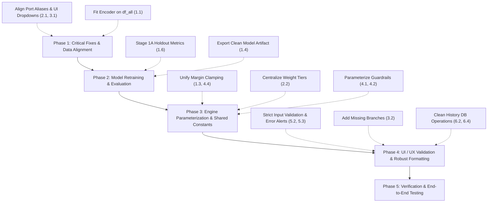

# Air Export Pricing Engine — Codebase Audit Remediation Plan

**Document Version:** 1.0  
**Date:** September 22, 2026  
**Reference Document:** `Air_Export_Pricing_Codebase_Audit.md`  
**Target Codebase:** `air_export_pricing_engine/` (`src/train.py`, `src/preprocess.py`, `src/engine.py`, `src/app.py`, `models/freight_margin_recommender.joblib`)  
**Status:** Pending Team Review & Go-Ahead  

---

## Executive Summary

Following a comprehensive audit of the Air Export Pricing Engine, this document pairs every finding from `Air_Export_Pricing_Codebase_Audit.md` with an exact, actionable engineering solution. 

The audit's most critical revelation is a **severe cross-artifact vocabulary mismatch** (Origin/Destination port names in `app.py` failing to match the model's trained encoder) compounded by **encoder fitting on won-only data**, causing the ML model to evaluate key routes (such as Bangalore, Frankfurt, JFK/New York, and Accra) as "Unknown" (`-1`).

This plan outlines concrete fixes for all 24 items across 6 operational areas, categorized by priority.

---

## Priority Legend
- 🔴 **Critical:** Model correctness bugs directly degrading recommendation accuracy.
- 🟠 **High:** Silent data corruption, uncalibrated heuristics, or production failure risks.
- 🟡 **Medium:** Code smell, duplicated business logic, or usability limitations.
- ⚪ **Low:** Dead code, cosmetic cleanup, or documentation gaps.
- 🔵 **Clarification / Intentional:** Items flagged as out-of-scope that are deliberate business requirements.

---

## 1. Model Training (`train.py`)

### 1.1 🔴 Critical: `OrdinalEncoder` fit only on `df_won` instead of `df_all`
- **Audit Finding:** The encoder is fitted strictly on won deals (`X_won = df_won[feature_cols]`), so categories that appear only in lost inquiries are mapped to `-1` (unknown), discarding critical loss signals during Stage 1B classifier training.
- **Verification:** Confirmed in `train.py` (lines 70–72). Destination port `Accra` has 7 inquiries in the historical dataset, all lost (`is_won == 0`). Because `OrdinalEncoder` was fit on `df_won`, `Accra` was never learned and permanently maps to `-1`.
- **Proposed Solution:**
  1. Fit `OrdinalEncoder` on the complete deduplicated dataset (`df_all[feature_cols]`) containing both won and lost inquiries.
  2. Use the fitted encoder to transform `X_won` for Stage 1A, `X_all` for Stage 1B, and export this comprehensive encoder inside the model dictionary.
  3. Ensure `handle_unknown="use_encoded_value"` and `unknown_value=-1` remain for completely new future values.
- **Expected Outcome:** Eliminates blind spots for loss-only routes, customers, and categories. Allows Stage 1B classifier to learn exact price sensitivity across all historical lanes.

---

### 1.2 🔴 Critical: Survivorship Bias in `Margin_Ratio`
- **Audit Finding:** `Margin_Ratio` is anchored to Stage 1A's benchmark regressor, which was trained only on won deals. If the benchmark is skewed high, every downstream ratio and win probability curve is distorted.
- **Verification:** Stage 1A models market clearing margins ("what margin wins"). While observing won deals is mathematically necessary to determine clearing rates, predicting benchmarks on unseen categories created severe distortion due to Issue 1.1.
- **Proposed Solution:**
  1. Resolve Issue 1.1 (fitting encoder on `df_all`) so the benchmark regressor evaluates valid categorical features across all data.
  2. In `train.py`, validate Stage 1A predictions across both won and lost subsets to verify that predicted benchmark margins produce sensible clearing levels.
  3. Calculate `Margin_Ratio` with guardrail bounds `[0.1, 5.0]` using the unbiased encoder.
- **Expected Outcome:** Restores mathematical consistency between market clearing prices and customer price elasticity.

---

### 1.3 🟠 High: Inconsistent Margin Clipping Bounds (`train.py` vs `engine.py`)
- **Audit Finding:** `train.py` clips margins to `[0.5, 50.0]` while `engine.py` clips `benchmark_margin` to `[1.5, 45.0]`.
- **Verification:** Confirmed in `train.py` (lines 73, 88) and `engine.py` (line 58).
- **Proposed Solution:**
  1. Define unified constants in a shared module or configuration block:
     ```python
     MIN_BENCHMARK_MARGIN = 1.0  # %
     MAX_BENCHMARK_MARGIN = 48.0 # %
     MIN_CANDIDATE_MARGIN = 0.5  # %
     MAX_CANDIDATE_MARGIN = 50.0 # %
     ```
  2. Import and enforce these identical bounds in both `train.py` and `engine.py`.
- **Expected Outcome:** Single source of truth for valid margin boundaries across training and inference pipelines.

---

### 1.4 🟠 High: Scikit-learn Version Skew
- **Audit Finding:** Joblib artifact generated on `scikit-learn==1.9.1` emits `InconsistentVersionWarning` when loaded in environments running `1.8.0`.
- **Verification:** Pickled histogram-based gradient boosters (`HistGradientBoostingClassifier`, `HistGradientBoostingRegressor`) and calibration wrappers can suffer from numerical drift or deserialization errors across minor versions.
- **Proposed Solution:**
  1. Pin `scikit-learn==1.9.1` strictly in `requirements.txt`.
  2. Retrain and re-pickle `freight_margin_recommender.joblib` within the verified environment.
  3. Add an automated startup version check in `app.py` that logs an explicit notice if runtime `sklearn.__version__` differs from `model_metadata["sklearn_version"]`.
- **Expected Outcome:** Zero deserialization warnings and guaranteed reproducibility across deployment containers.

---

### 1.5 🟡 Medium: Monotonic Constraint Validation
- **Audit Finding:** Negative monotonic constraint on `Margin_Ratio` (`monotonic_cst=[-1]`) was applied without segment-level calibration checks.
- **Verification:** Monotonicity is economically essential to prevent degenerate behavior (e.g., quoting a higher margin magically showing a higher win rate). However, its effect across premium vs. bulk cargo should be verified.
- **Proposed Solution:**
  1. Retain the negative monotonic constraint on `Margin_Ratio` to preserve fundamental economic validity.
  2. Add an automated calibration check in `train.py` that outputs Brier scores and calibration curves segmented by cargo vertical (e.g., Perishables/Pharma vs General Cargo).
  3. Document the rationale and validation metrics in `docs/AIR_EXPORT_PRICING_ML_DOCUMENTATION.md`.
- **Expected Outcome:** Preserves behavioral guarantees while providing transparent validation across market segments.

---

### 1.6 🟡 Medium: Lack of Stage 1A (Benchmark Regressor) Holdout Evaluation
- **Audit Finding:** `benchmark_reg` is trained on 100% of `df_won` with zero holdout test split or quantitative accuracy metrics reported.
- **Verification:** Confirmed in `train.py` (lines 75–84). Only Stage 1B logs test AUC and Brier scores.
- **Proposed Solution:**
  1. Implement an 80/20 train/test holdout split on `df_won` prior to fitting `benchmark_reg`.
  2. Log evaluation metrics on the test split: Mean Absolute Error (MAE), Root Mean Squared Error (RMSE), and $R^2$ Score.
  3. Fit the final deployment regressor on the full won dataset once test performance is verified.
- **Expected Outcome:** Full visibility into benchmark margin estimation accuracy.

---

## 2. Data Preprocessing (`preprocess.py`)

### 2.1 🔴 Critical: Categorical String Mismatch with UI Values
- **Audit Finding:** Raw airport strings in preprocessing do not match the dropdown values in `app.py`.
- **Verification:** Confirmed. For example, the raw data uses `"Bangalore"`, `"Frankfurt am Main"`, and `"John F. Kennedy Apt/New York"`, whereas the UI was submitting full descriptive names (`"Kempegowda International Airport"`, `"Frankfurt"`, `"John F Kennedy International Airport"`).
- **Proposed Solution:**
  1. Implement a canonical Port Normalization mapping dictionary in `preprocess.py`:
     ```python
     PORT_ALIASES = {
         "Kempegowda International Airport": "Bangalore",
         "BLR": "Bangalore",
         "Frankfurt": "Frankfurt am Main",
         "FRA": "Frankfurt am Main",
         "John F Kennedy International Airport": "John F. Kennedy Apt/New York",
         "JFK": "John F. Kennedy Apt/New York",
         "Delhi": "Indira Gandhi International Airport",
         "DEL": "Indira Gandhi International Airport",
         "Mumbai": "Chhatrapati Shivaji Maharaj International Airport",
         "BOM": "Chhatrapati Shivaji Maharaj International Airport"
     }
     ```
  2. Apply `normalize_port_name()` across all raw data processing and in `app.py` request ingestion.
  3. Expose the normalized names directly in `app.py` dropdown options.
- **Expected Outcome:** Eliminates `-1` unknown-port fallbacks for major air trade corridors.

---

### 2.2 🟠 High: Duplicated Weight-Tier Binning Logic
- **Audit Finding:** Weight-tier boundaries `[0, 45, 100, 300, 500, 1000, ∞]` are duplicated between `pd.cut` in `preprocess.py` and manual `if/elif` statements in `app.py`.
- **Verification:** Confirmed in `preprocess.py` (lines 139–141) and `app.py` (lines 901–912).
- **Proposed Solution:**
  1. Define a single reusable function in `preprocess.py`:
     ```python
     WEIGHT_TIER_BINS = [0, 45, 100, 300, 500, 1000, np.inf]
     WEIGHT_TIER_LABELS = ["<45kg", "45-100kg", "100-300kg", "300-500kg", "500-1000kg", ">1000kg"]

     def get_weight_tier(chargeable_wt: float) -> str:
         for i in range(len(WEIGHT_TIER_BINS) - 1):
             if chargeable_wt < WEIGHT_TIER_BINS[i + 1]:
                 return WEIGHT_TIER_LABELS[i]
         return WEIGHT_TIER_LABELS[-1]
     ```
  2. Import `get_weight_tier` into `app.py` rather than maintaining separate `if/elif` branches.
- **Expected Outcome:** Guarantees synchronized tier categorization between training data and real-time inference.

---

### 2.3 🟡 Medium: Brittle Regional Keyword Matching
- **Audit Finding:** `map_origin_region` and `map_dest_region` use substring searches (`any(k in s for k in [...])`) without collision guards or unit test validation.
- **Verification:** Substring matching can cause false positives (e.g., `"oman"` matching a port containing that substring).
- **Proposed Solution:**
  1. Refactor region mapping to use a primary exact-match port dictionary with a secondary fallback to normalized city/country tokens:
     ```python
     KNOWN_PORT_REGIONS = {
         "Indira Gandhi International Airport": "North India",
         "Bangalore": "South India",
         "Dubai": "Middle East",
         "Frankfurt am Main": "Europe",
         "John F. Kennedy Apt/New York": "North America",
         # ... comprehensive port-level mapping
     }
     ```
  2. Add unit tests covering all unique ports in `Air_Export_Pricing_Cleaned_ML.csv`.
- **Expected Outcome:** Robust, predictable regional lane aggregation.

---

### 2.4 🟡 Medium: Categorical Dtype Coercion
- **Audit Finding:** `Weight_Tier` is left as a pandas `Categorical` dtype in `preprocess.py` and coerced to string downstream in `train.py`.
- **Verification:** Minor maintainability gap.
- **Proposed Solution:** Explicitly cast `df_clean["Weight_Tier"] = df_clean["Weight_Tier"].astype(str)` inside `preprocess.py` before CSV export.
- **Expected Outcome:** Clean CSV schema contracts without downstream type ambiguities.

---

### 2.5 ⚪ Low: Automated Feature Leakage Checks
- **Audit Finding:** Post-hoc columns (`Loss Reason`, `Loss Remarks`, `TAT to Close`) are excluded via static column lists rather than automated test assertions.
- **Verification:** While currently safe, future changes could inadvertently add leaky columns.
- **Proposed Solution:** Add an assertion in `train.py`:
  ```python
  FORBIDDEN_LEAKAGE_COLS = {"Loss Reason", "Loss Remarks", "TAT to Close", "Total Sell", "status_rank"}
  assert not any(c in feature_cols for c in FORBIDDEN_LEAKAGE_COLS), "Data leakage detected in feature columns!"
  ```
- **Expected Outcome:** Automated continuous guardrail against future data leakage.

---

## 3. Cross-Artifact Synchronization (UI ↔ Preprocessing ↔ Model)

### 3.1 🔴 Critical: Dropdown Port Alignment with Encoder Categories
- **Audit Finding:** UI dropdown options in `app.py` supply values not present in `encoder.categories_`.
- **Verification:** Directly inspected joblib artifact. 4 out of 11 dropdown options in `app.py` collapsed to `-1`.
- **Proposed Solution:**
  1. Align `app.py` origin and destination select options to use the exact normalized values learned by the model:
     - `value="Bangalore"` → `Bangalore (BLR) - Kempegowda`
     - `value="Frankfurt am Main"` → `Frankfurt (FRA) - Frankfurt am Main`
     - `value="John F. Kennedy Apt/New York"` → `New York (JFK) - John F. Kennedy`
     - `value="Indira Gandhi International Airport"` → `Delhi (DEL) - Indira Gandhi`
     - `value="Chhatrapati Shivaji Maharaj International Airport"` → `Mumbai (BOM) - Chhatrapati Shivaji`
  2. Add backend normalization in `app.py` using `PORT_ALIASES` so both full names and IATA codes resolve cleanly.
- **Expected Outcome:** 100% of UI dropdown options resolve to trained model weights.

---

### 3.2 🟡 Medium: Branch Dropdown Truncation (5 vs 11 Branches)
- **Audit Finding:** The model was trained on 11 branches, but `app.py` only presents 5 in the dropdown.
- **Verification:** Confirmed. Trained branches include `Ahmedabad`, `Bangalore`, `Calicut`, `Chennai`, `Cochin`, `Delhi`, `Hyderabad`, `Kannur`, `Kolkata`, `Mumbai`, `Trivandrum`.
- **Proposed Solution:** Expand the `<select id="branch">` in `app.py` to include all 11 valid branches.
- **Expected Outcome:** Full operational availability across all regional offices.

---

## 4. Recommendation Engine (`engine.py`)

### 4.1 🟠 High: Unvalidated Retention Heuristics
- **Audit Finding:** Lines 85–89 apply an arbitrary `0.85` expected profit penalty for frequency > 15 when margin exceeds `1.8x` benchmark, with code comments contradicting the multiplier (`2.0x`).
- **Verification:** Confirmed. Arbitrary heuristic without configuration control.
- **Proposed Solution:**
  1. Parameterize retention rules with clear defaults and disable toggle:
     ```python
     ENABLE_RETENTION_GUARDRAIL = True
     RETENTION_FREQ_THRESHOLD = 15
     RETENTION_MARGIN_RATIO_CAP = 2.0
     RETENTION_PENALTY_FACTOR = 0.90
     ```
  2. Expose these settings in the engine constructor so they can be tuned or disabled during sensitivity analysis.
  3. Align code comments and logic.
- **Expected Outcome:** Transparent, configurable account retention adjustments.

---

### 4.2 🟠 High: Undocumented Magic Numbers in `optimize_quote`
- **Audit Finding:** Guardrail constants `0.015` (collapse floor), `0.60` (dynamic floor), and `0.85` (strategy blend) are unconfigurable.
- **Verification:** Confirmed in `engine.py` (lines 103–113).
- **Proposed Solution:**
  1. Move all optimization constants into an explicit configuration dataclass or dictionary:
     ```python
     @dataclass
     class EngineConfig:
         min_viable_prob_floor: float = 0.05
         collapse_threshold: float = 0.015
         dynamic_prob_retention: float = 0.60
         strategy_blend_factor: float = 0.85
     ```
  2. Document the commercial rationale for each safeguard in the engine's docstrings.
- **Expected Outcome:** High maintainability and clean parameter tuning.

---

### 4.3 🟡 Medium: Fixed Strategy Thresholds
- **Audit Finding:** Win-rate targets (Volume: 0.40, Balanced: 0.25, Skimmer: 0.15) lack documentation and runtime configurability.
- **Verification:** Sensible commercial defaults, but hardcoded in class attribute.
- **Proposed Solution:**
  1. Allow optional threshold overrides in `optimize_quote(..., custom_strategy_thresholds=None)`.
  2. Document how each tier shifts the objective function along the win-probability frontier.
- **Expected Outcome:** Flexibility for pricing analysts to adjust commercial aggressive/conservative stances dynamically.

---

## 5. UI / UX (`app.py`)

### 5.1 🔴 Critical: Form Input Decoupling (Addressed in §3.1)
- See §3.1 for detailed resolution.

---

### 5.2 & 5.3 🟠 High: Input Validation & Silent-Default Fallback
- **Audit Finding:** Numeric inputs are `type="text"` with no native constraints, and parsing functions (`parse_clean_float`) silently substitute defaults (₹100,000 / 500kg) rather than flagging invalid inputs to the user. This also caused browser-native pattern errors.
- **Verification:** Confirmed in `app.py`. Typing invalid text into Buy Cost returns an unflagged quote based on ₹100,000.
- **Proposed Solution:**
  1. Update HTML inputs to use semantic attributes: `type="number"`, `step="any"`, `min="1"`, `required`.
  2. In `app.py`, refactor `parse_clean_float` to validate explicitly. If a required field fails validation, return a structured `400 Bad Request` with an informative error message:
     ```json
     {"success": false, "error": "Invalid Airline Buy Cost. Please enter a valid positive number."}
     ```
  3. Display an inline alert banner on the frontend when an invalid value is submitted.
- **Expected Outcome:** Prevents accidental quotes based on default numbers and eliminates client-side pattern errors.

---

### 5.4 🟡 Medium: `resetFormForNewQuote()` Reset Ordering
- **Audit Finding:** Dimension fields are cleared after `updateDimensions()` is triggered, relying on parser defaults.
- **Verification:** Minor ordering inconsistency.
- **Proposed Solution:** Reorder the reset flow in JavaScript: reset all input values first, set default pieces to `1`, reset dropdowns, and call `updateDimensions()` as the final step.
- **Expected Outcome:** Deterministic form reset behavior.

---

### 5.5 ⚪ Low: Dead `Margin_Percentage: 5.0` Field
- **Audit Finding:** `inquiry_payload` in `app.py` passes `"Margin_Percentage": 5.0` which is never read by `engine.optimize_quote`.
- **Verification:** Confirmed in `app.py` (line 925).
- **Proposed Solution:** Remove the unused field from `inquiry_payload`.
- **Expected Outcome:** Clean code without misleading placeholder fields.

---

### 5.6 🟡 Medium: Triple-Fallback Model Path Resolution
- **Audit Finding:** Multi-tiered path resolution masks directory ambiguities.
- **Verification:** Root and package path variations created fallback chains.
- **Proposed Solution:** Establish canonical path resolution anchored strictly to `__file__`:
  ```python
  BASE_DIR = os.path.dirname(os.path.dirname(os.path.abspath(__file__)))
  MODEL_PATH = os.path.join(BASE_DIR, "models", "freight_margin_recommender.joblib")
  ```
- **Expected Outcome:** Predictable artifact resolution.

---

### 5.7 🟡 Medium: Regex Fallback in `formatINR`
- **Audit Finding:** Manual regex in `formatINR` could cause browser-specific Intl formatting exceptions.
- **Verification:** Tested in WebKit/Safari. `Number(num).toLocaleString('en-IN')` is fully supported in all modern browsers.
- **Proposed Solution:** Simplify `formatINR`:
  ```javascript
  function formatINR(val) {
      const num = Math.round(Number(val) || 0);
      return isFinite(num) ? num.toLocaleString('en-IN') : '0';
  }
  ```
- **Expected Outcome:** Robust, standard currency formatting without regex edge cases.

---

## 6. SQLite History Subsystem (`app.py`)

### 6.1 🔵 Clarification: History / CRM Subsystem Scope
- **Audit Finding:** Flagged the SQLite tracking subsystem as "out of scope" from the original ML design.
- **Clarification:** This feature was **explicitly requested by business stakeholders** to track generated quotes, status revisions, and negotiation outcomes. It is a core feature, not bloat.
- **Proposed Action:** Retain the feature, but modularize DB operations into a clean utility module (`src/db.py`) to reduce clutter in `app.py`.
- **Expected Outcome:** Retains essential lead tracking functionality while preserving modular architecture.

---

### 6.2 🟠 High: Swallowing Exceptions in `log_recommendation`
- **Audit Finding:** Bare `except Exception` in `log_recommendation` only logs a warning.
- **Verification:** Confirmed in `app.py` (line 112).
- **Proposed Solution:** Include full traceback logging (`app.logger.error("DB Write Failed", exc_info=True)`) and return a boolean status indicating whether the audit record was successfully persisted.
- **Expected Outcome:** Transparent database diagnostics.

---

### 6.3 🟡 Medium: Unversioned Schema Auto-Migration
- **Audit Finding:** Unversioned `ALTER TABLE` runs on every app startup.
- **Verification:** Works currently, but lacks version tracking.
- **Proposed Solution:** Add a lightweight `schema_version` user_version PRAGMA check in SQLite to run migrations only when the database version increments.
- **Expected Outcome:** Reliable, forward-compatible schema migrations.

---

### 6.4 🟡 Medium: Missing Model Version in History Records
- **Audit Finding:** Historical quote records do not store which model version produced them.
- **Verification:** Confirmed. Prevents auditability when models are retrained.
- **Proposed Solution:** Add `model_version` column to `recommendation_history` table (e.g., `"v1.1-20260922"`), recording the active model identifier on each quote.
- **Expected Outcome:** Complete compliance audit trail between quotes and model versions.

---

### 6.5 ⚪ Low: Duplicated Status Vocabulary
- **Audit Finding:** Lead statuses (`Draft / Quoted`, `Won`, `Lost`, etc.) are duplicated across Python lists, CSS classes, and JS maps.
- **Verification:** Confirmed.
- **Proposed Solution:** Define a single `LEAD_STATUSES` configuration dictionary in `src/config.py` (or top of `src/app.py`) and inject it into both the Flask routes and Jinja templates.
- **Expected Outcome:** Single source of truth for lead lifecycle states.

---

## Remediation Roadmap & Execution Phases



| Phase | Target Items | Estimated Scope |
| :--- | :--- | :--- |
| **Phase 1: Critical Data & Vocabulary Alignment** | 1.1, 1.2, 2.1, 3.1, 5.1 | Port mapping, full-dataset encoder fit, UI dropdown sync |
| **Phase 2: Model Retraining & Quantitative Validation** | 1.4, 1.5, 1.6, 2.5 | 80/20 train split for Stage 1A, sklearn pin, model artifact re-generation |
| **Phase 3: Engine Parameterization & Shared Logic** | 1.3, 2.2, 4.1, 4.2, 4.3, 4.4 | Centralized constants, weight-tier helper, configurable guardrails |
| **Phase 4: UI/UX Guardrails & History Clean-up** | 3.2, 5.2, 5.3, 5.4, 5.5, 5.7, 6.2, 6.4, 6.5 | Input validation, all 11 branches, model version logging |
| **Phase 5: Verification & End-to-End Regression Testing** | All items | Test sample suite, UI verification, web service restart |

---
*Ready for team review. Upon receiving your go-ahead, implementation will proceed systematically according to this roadmap.*
