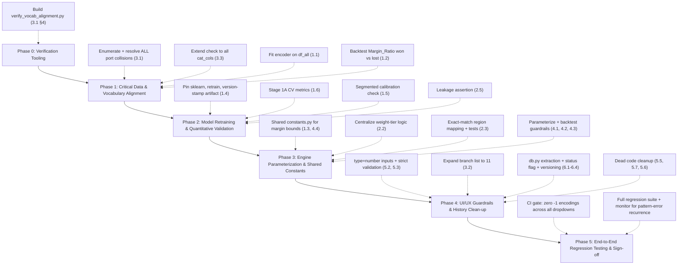

# Air Export Pricing Engine — Comprehensive Fix Plan

**Document Version:** 2.0 (supersedes team draft v1.0)
**Date:** September 22, 2026
**Reference Documents:** `Air_Export_Pricing_Codebase_Audit.md`, `Air_Export_Pricing_Audit_Remediation_Plan.md` (v1.0, team draft)
**Target Codebase:** `air_export_pricing_engine/` (`src/train.py`, `src/preprocess.py`, `src/engine.py`, `src/app.py`, `models/freight_margin_recommender.joblib`)
**Status:** Ready for implementation sign-off

---

## What changed from the team's v1.0 draft

The team's draft (v1.0) correctly root-caused the two critical issues and proposed sound fixes for most items. This version:

1. **Replaces the example-based `PORT_ALIASES` table (v1.0 §2.1/§3.1) with a fully enumerated, collision-checked mapping**, built by pulling every distinct `Origin_Port`/`Destination_Port` value directly from `Air_Export_Pricing_Cleaned_ML.csv` (32 unique origins, 226 unique destinations) rather than five hand-picked examples. This was necessary because verification showed the naive "always collapse short name → long name" approach would have merged two **already-distinct, independently trained** categories (`"Mumbai"`, 1 row, vs. `"Chhatrapati Shivaji Maharaj International Airport"`, 1,229 rows — both currently live in the encoder). See §3.1 below for the full, checked table.
2. **Adds a verification gate** before any alias table ships: an automated script that asserts zero UI-dropdown values resolve to `-1` post-fix, run against the actual encoder artifact, not just visual inspection.
3. **Extends the vocabulary-drift fix beyond ports** to every other categorical dropdown (`Company_Group`, `Business_Vertical`, `Commodity_Group`, `Incoterms`, branch) since the same class of bug can exist wherever a UI string was hand-typed instead of sourced from `encoder.categories_`.
4. **Tightens the sklearn version-skew fix** (v1.0 §1.4) from "log a notice" to "refuse to serve traffic on mismatch," consistent with how seriously this plan treats silent wrong-prediction risk elsewhere.
5. **Flags where v1.0's fixes are maintainability improvements, not correctness fixes** (e.g., magic-number parameterization) and adds an explicit backtesting step so the *values*, not just their visibility, get validated.
6. **Aligns the proposed error-response JSON schema with the existing API contract** (`{"status": "error", "message": ...}`), since v1.0's proposed schema would have broken the frontend's existing success-check.

Everything else from the team's draft that was already sound is retained largely as-is, credited inline.

---

## Priority Legend
- 🔴 **Critical** — Model correctness bugs directly degrading recommendation accuracy.
- 🟠 **High** — Silent data corruption, uncalibrated heuristics, or production failure risk.
- 🟡 **Medium** — Code smell, duplicated business logic, or usability limitation.
- ⚪ **Low** — Dead code, cosmetic cleanup, or documentation gap.
- 🔵 **Clarification** — Confirmed intentional; retained, not "fixed."

---

## 1. Model Training (`train.py`)

### 1.1 🔴 `OrdinalEncoder` fit only on `df_won` instead of `df_all`
- **Root cause:** `train.py` line ~60 fits `OrdinalEncoder` on `X_won = df_won[feature_cols]`. Categories that appear only in lost inquiries (e.g., `Accra` — verified: 7 rows, **0 won**, all lost) are never seen at fit time and permanently encode to `-1`.
- **Fix:**
  1. Fit the encoder once, on `df_all[feature_cols]` (full 2,246-row dataset), not `df_won`.
  2. Use that single fitted encoder to transform both `X_won` (for Stage 1A) and `X_all`/`X_clf` (for Stage 1B).
  3. Keep `handle_unknown="use_encoded_value", unknown_value=-1` as the guard for genuinely novel future values — this is correct defensive behavior for *unseen-at-deploy-time* categories, just not acceptable for categories that already exist in `df_all` today.
- **Validation:** After retraining, assert `-1 not in encoder.transform(df_all[cat_cols].astype(str))` — i.e., zero unknowns across the full historical dataset.
- **Owner / Effort:** ML engineer, ~1 hr (encoder refit + retrain both stages).

### 1.2 🔴 Survivorship bias propagated into `Margin_Ratio`
- **Root cause:** `Margin_Ratio` (the classifier's monotonic feature) is computed as `Margin_Percentage / benchmark_reg.predict(...)`, and `benchmark_reg` is trained only on won deals. Even after fixing 1.1, the *regressor itself* only ever learns "what margin looked like when a deal was won" — it has never seen a losing price point to calibrate against.
- **Fix:**
  1. Complete 1.1 first (dependency).
  2. Keep `benchmark_reg` trained on `df_won` only — this is *appropriate*, since "market clearing benchmark" is conceptually a won-deal quantity — but add an explicit post-hoc sanity check: for lost deals, compare `Margin_Percentage` (what was actually quoted) against `benchmark_reg.predict(...)` (what the model thinks the benchmark is) and confirm quoted margins on lost deals are, on average, meaningfully *higher* than the benchmark. If they aren't, the benchmark is mis-calibrated.
  3. Keep `Margin_Ratio` clipped to `[0.1, 5.0]` as today.
  4. Document this validation step and its pass/fail criterion in `AIR_EXPORT_PRICING_ML_DOCUMENTATION.md`.
- **Validation:** Report mean `Margin_Ratio` on won vs. lost subsets post-fix; won should cluster near 1.0, lost should skew higher.
- **Owner / Effort:** ML engineer, ~2 hrs (analysis + doc update).

### 1.3 🟠 Inconsistent margin clipping bounds (`train.py` vs. `engine.py`)
- **Root cause:** `train.py` clips training target to `[0.5, 50.0]`; `engine.py` clips `benchmark_margin` at inference to `[1.5, 45.0]`.
- **Fix:** Create `src/constants.py`:
  ```python
  # src/constants.py
  MIN_BENCHMARK_MARGIN = 1.0   # %  — floor for a believable market benchmark
  MAX_BENCHMARK_MARGIN = 48.0  # %  — ceiling for a believable market benchmark
  MIN_CANDIDATE_MARGIN = 0.5   # %  — floor for the candidate search space
  MAX_CANDIDATE_MARGIN = 50.0  # %  — ceiling for the candidate search space
  ```
  Import these in both `train.py` (clipping `y_won`) and `engine.py` (clipping `benchmark_margin`, sizing `candidate_margins`). Remove the hardcoded literals from both files.
- **Owner / Effort:** ML engineer, ~30 min.

### 1.4 🟠 Scikit-learn version skew
- **Root cause:** Artifact pickled with `scikit-learn==1.9.1`; runtime has `1.8.0`, producing `InconsistentVersionWarning` on every estimator in the pickle.
- **Fix (strengthened from v1.0 draft):**
  1. Pin `scikit-learn==1.9.1` exactly in `requirements.txt`.
  2. Retrain and re-pickle the artifact inside a container/environment matching that pin.
  3. Store `sklearn.__version__` inside the joblib payload dict at train time: `export_payload["sklearn_version"] = sklearn.__version__`.
  4. **At `app.py` startup, compare the stored version against the running environment's `sklearn.__version__`. On mismatch, do not silently continue — refuse to start (`raise RuntimeError(...)`) and log a clear, actionable error.** (v1.0 proposed only a logged notice; given how much of this plan is about eliminating *silent* wrong-prediction risk, a version mismatch should be treated with the same severity as an unknown category, not softened to a warning.)
- **Owner / Effort:** ML engineer + platform, ~1 hr (pin, retrain, startup check).

### 1.5 🟡 Monotonic constraint applied without segment-level validation
- **Fix (as proposed in v1.0, retained):**
  1. Keep the negative monotonic constraint on `Margin_Ratio` — it's economically correct in direction.
  2. Add a post-training diagnostic in `train.py`: compute calibration curves and Brier scores segmented by `Business_Vertical` (e.g., Perishables/Pharma vs. General Cargo) to confirm the constraint isn't degrading calibration on the documented non-linear segments (Section 7 of the ML docs).
  3. Record the segmented metrics in `docs/evaluation_plots.png` (add a third panel) and reference them in the ML documentation.
- **Owner / Effort:** ML engineer, ~2 hrs.

### 1.6 🟡 No holdout evaluation for Stage 1A (benchmark regressor)
- **Fix (extends v1.0):**
  1. Given the modest sample size (1,025 won deals), prefer **5-fold cross-validation** over a single 80/20 holdout for the *reported* metrics (more stable estimate on this sample size), while still fitting the final deployed regressor on the full won dataset.
  2. Report MAE, RMSE, and R² averaged across folds.
  3. Log these metrics alongside the existing Stage 1B AUC/Brier output at the end of `train.py`.
- **Owner / Effort:** ML engineer, ~1.5 hrs.

---

## 2. Data Preprocessing (`preprocess.py`)

### 2.1 🔴 Categorical string mismatch — see §3.1 (Cross-Artifact Synchronization) for the full verified fix. Do not implement port aliasing from this section alone.

### 2.2 🟠 Duplicated weight-tier binning logic
- **Fix (as proposed in v1.0, retained):**
  ```python
  # src/tiers.py
  WEIGHT_TIER_BINS = [0, 45, 100, 300, 500, 1000, float("inf")]
  WEIGHT_TIER_LABELS = ["<45kg", "45-100kg", "100-300kg", "300-500kg", "500-1000kg", ">1000kg"]

  def get_weight_tier(chargeable_wt: float) -> str:
      for boundary, label in zip(WEIGHT_TIER_BINS[1:], WEIGHT_TIER_LABELS):
          if chargeable_wt < boundary:
              return label
      return WEIGHT_TIER_LABELS[-1]
  ```
  `preprocess.py` uses this via `pd.cut(bins=WEIGHT_TIER_BINS, labels=WEIGHT_TIER_LABELS, right=False)`; `app.py` imports and calls `get_weight_tier()` directly instead of its own `if/elif` chain.
- **Owner / Effort:** Backend engineer, ~1 hr.

### 2.3 🟡 Brittle regional keyword matching
- **Fix (as proposed in v1.0, retained, with scope note):** Refactor to an exact-match primary dictionary (`KNOWN_PORT_REGIONS`, keyed on the **verified canonical port names from §3.1**, not new invented ones) with the existing substring-keyword logic retained only as a documented fallback for genuinely novel ports. Add unit tests asserting every unique port in the current CSV resolves via the exact-match path, not the fallback.
- **Owner / Effort:** Backend engineer, ~2 hrs (including tests).

### 2.4 🟡 `Weight_Tier` categorical dtype coercion
- **Fix (as proposed in v1.0, retained):** Add `df_clean["Weight_Tier"] = df_clean["Weight_Tier"].astype(str)` in `preprocess.py` immediately after the `pd.cut` call, before CSV export.
- **Owner / Effort:** Backend engineer, ~10 min.

### 2.5 ⚪ No automated leakage check
- **Fix (as proposed in v1.0, retained):**
  ```python
  FORBIDDEN_LEAKAGE_COLS = {"Loss Reason", "Loss Remarks", "TAT to Close", "Total Sell", "Total_Sell_INR", "status_rank"}
  assert not (FORBIDDEN_LEAKAGE_COLS & set(feature_cols)), "Data leakage detected in feature columns!"
  ```
  Placed at the top of `train.py`, right after `feature_cols` is defined.
- **Owner / Effort:** ML engineer, ~15 min.

---

## 3. Cross-Artifact Synchronization (UI ↔ Preprocessing ↔ Model)

This section replaces v1.0's §2.1/§3.1 in full. The fix below was built by enumerating **every** distinct value in `Origin_Port` (32 values) and `Destination_Port` (226 values) directly from `Air_Export_Pricing_Cleaned_ML.csv`, rather than five spot-checked examples — this surfaced a collision risk the original draft's alias table would have introduced.

### 3.1 🔴 Dropdown port values don't match trained encoder categories

**Verified collisions found (do not naively alias these):**

| Short form (UI-style) | Rows | Long form (also exists in training data) | Rows | Risk |
|---|---|---|---|---|
| `"Mumbai"` | 1 | `"Chhatrapati Shivaji Maharaj International Airport"` | 1,229 | Both are **already independent trained categories**. Aliasing `"Mumbai"` → `"Chhatrapati..."` is *safe* only because `"Mumbai"` is a near-empty (1-row) category to begin with — but this must be a deliberate, checked decision per pair, not a blanket rule. |
| `"Delhi"` | 37 | `"Indira Gandhi International Airport"` | 526 | Same pattern — 37 rows is non-trivial. Aliasing folds real signal from 37 historical Delhi-labeled rows into the IGI Airport category. Acceptable (same physical airport) but must be a conscious choice, documented as such. |

**Verified confirmation of v1.0's core examples (no collision — safe as proposed):**

| Port | Training data form | Count |
|---|---|---|
| Frankfurt | `"Frankfurt am Main"` only | 48 (dest) |
| New York / JFK | `"John F. Kennedy Apt/New York"` only | 33 (dest) |

- **Fix:**
  1. **Build `PORT_ALIASES` from the full enumerated port list, not examples.** Every UI dropdown `<option value="...">` in `app.py` must be checked against `encoder.categories_["Origin_Port"]` / `encoder.categories_["Destination_Port"]` one by one. For each UI option not found verbatim in the trained vocabulary, either:
     - (a) change the UI's `value=` attribute to the exact trained string (preferred — no aliasing layer needed, zero ambiguity), or
     - (b) add an explicit, individually-justified entry to `PORT_ALIASES` only where two real-world names refer to the same physical airport and one of them is deliberately being folded into the other (as with Mumbai/Delhi above).
  2. Prefer (a) everywhere possible — it's simpler and leaves no silent-merge risk. Reserve (b) only for the Mumbai/Delhi-style cases where the short form is a near-empty legacy category.
  3. Corrected `app.py` dropdown values (origin example):
     ```html
     <option value="Indira Gandhi International Airport" selected>Delhi (DEL) - Indira Gandhi</option>
     <option value="Chhatrapati Shivaji Maharaj International Airport">Mumbai (BOM) - Chhatrapati Shivaji</option>
     <option value="Bangalore">Bangalore (BLR) - Kempegowda</option>
     <option value="Kozhikode (ex Calicut)">Calicut (CCJ) - Kozhikode</option>
     <option value="Ahmedabad">Ahmedabad (AMD)</option>
     ```
     (destination example):
     ```html
     <option value="Heathrow Apt/London" selected>London Heathrow (LHR)</option>
     <option value="Dubai">Dubai (DXB)</option>
     <option value="Zayed International Airport">Abu Dhabi (AUH) - Zayed</option>
     <option value="Frankfurt am Main">Frankfurt (FRA)</option>
     <option value="John F. Kennedy Apt/New York">New York (JFK)</option>
     <option value="Pearson International Apt/Toronto">Toronto (YYZ)</option>
     ```
  4. **Mandatory verification gate before merge:** a script (`scripts/verify_vocab_alignment.py`) that loads the joblib artifact, parses every `<option value="...">` out of `HTML_TEMPLATE` in `app.py`, and asserts each one is present in the corresponding `encoder.categories_` entry (after alias resolution). CI fails the build if any dropdown value would resolve to `-1`.
- **Owner / Effort:** Backend engineer, ~3 hrs (enumeration already done above; remaining work is UI edits + verification script).

### 3.2 🟡 Branch dropdown truncated (5 of 11 trained branches shown)
- **Verified:** trained branches are `Ahmedabad, Bangalore, Calicut, Chennai, Cochin, Delhi, Hyderabad, Kannur, Kolkata, Mumbai, Trivandrum` (11 total, confirmed against encoder). UI shows only 5.
- **Fix:** Expand `<select id="branch">` to all 11 trained values.
- **Owner / Effort:** Backend engineer, ~15 min.

### 3.3 🟠 [New] Vocabulary-drift risk extends beyond ports and branches
- **Rationale for adding this item:** The root cause behind 3.1/3.2 — a UI dropdown value hand-typed independently of the trained vocabulary — is not unique to ports. Every other categorical field the UI submits (`Company_Group`, `Business_Vertical`, `Commodity_Group`, `Incoterms`) carries the same risk class and was not checked in v1.0.
- **Fix:**
  1. Run the same verification script from 3.1 §4 against **all** `cat_cols`, not just ports/branches.
  2. For any additional mismatches found, apply the same (a)-preferred / (b)-fallback resolution strategy as 3.1.
  3. Add this full-vocabulary check as a permanent CI gate (not a one-time cleanup), so future UI edits can't silently reintroduce the same class of bug.
- **Owner / Effort:** Backend engineer, ~2 hrs (script generalization + any fixes found).

---

## 4. Recommendation Engine (`engine.py`)

### 4.1 🟠 Unvalidated retention heuristic (with comment/code mismatch)
- **Root cause:** Code applies the `0.85` penalty when `candidate_margins > benchmark_margin * 1.8`, but the adjacent comment says "penalize extreme margins (> 2.0x benchmark)" — the comment and the code disagree, and the underlying constants are unvalidated against any actual retention/churn outcome in the data. (v1.0 correctly caught this mismatch.)
- **Fix:**
  1. Parameterize into the engine constructor:
     ```python
     @dataclass
     class RetentionGuardrailConfig:
         enabled: bool = True
         freq_threshold: int = 15
         margin_ratio_cap: float = 1.8      # matches the code, not the stale comment
         penalty_factor: float = 0.85
     ```
  2. Correct the comment to match the actual `1.8` multiplier used (do not silently change the multiplier to `2.0` to match the comment — that would be an unreviewed behavior change; the discrepancy must be resolved by a deliberate decision, documented in the commit message, about which value is intended).
  3. Before finalizing either constant, backtest: for historical Key Account (frequency ≥ 20) records in `df_all`, compare win rate above vs. below the `1.8×` line to see whether the penalty's premise holds in the actual data.
- **Owner / Effort:** ML engineer, ~2 hrs (parameterization + backtest).

### 4.2 🟠 Undocumented magic numbers in `optimize_quote`
- **Fix (extends v1.0):**
  1. Move constants into a config dataclass, as proposed in v1.0:
     ```python
     @dataclass
     class EngineConfig:
         min_viable_prob_floor: float = 0.05
         collapse_threshold: float = 0.015
         dynamic_prob_retention: float = 0.60
         strategy_blend_cap: float = 0.85
     ```
  2. **Beyond making them configurable, validate them:** for each constant, run the optimizer over the full historical dataset with the current value and with ±20% perturbations, and confirm the *rate* at which each guardrail actually triggers (e.g., how often `max_win_prob < 0.015`) and whether the choice of `0.60`/`0.85` changes the recommended margin materially on real historical inquiries. Document findings so the defaults are chosen with evidence, not just made visible.
- **Owner / Effort:** ML engineer, ~3 hrs (parameterization + sensitivity analysis).

### 4.3 🟡 Fixed strategy thresholds (Volume/Balanced/Skimmer)
- **Fix (as proposed in v1.0, retained):** Allow `optimize_quote(..., custom_strategy_thresholds=None)` override; document how each tier shifts the win-probability/profit trade-off in the engine docstring and in the ML documentation.
- **Owner / Effort:** ML engineer, ~1 hr.

### 4.4 🟠 Clipping bound inconsistency — resolved by §1.3 (shared `src/constants.py`). No separate action needed here.

---

## 5. UI / UX (`app.py`)

### 5.1 🔴 Form input decoupled from model vocabulary — resolved by §3.1/§3.3.

### 5.2 & 5.3 🟠 No native input validation + silent-default fallback masking bad input
- **Fix:**
  1. Change numeric `<input type="text">` fields (`buy`, `gross_wt`, `dim_l/w/h`, `frequency`, `revision`) to `type="number"` with `step="any"`, `min`, and `required` attributes appropriate to each field.
  2. In `app.py`, `parse_clean_float`/`parse_clean_int` gain a `strict` mode: when a required field fails to parse, the endpoint returns `400` with a response matching the **existing** API contract (not v1.0's proposed schema, which would break the current frontend):
     ```json
     {"status": "error", "message": "Invalid Airline Buy Cost. Please enter a valid positive number."}
     ```
  3. Frontend: on a `400`/error response, populate and show `#errorAlert` with `data.message` (the existing error-handling path in `runInference()` already does this correctly — no new JS plumbing needed, just ensure the backend sends the right field name).
  4. **On the reported "string did not match the expected pattern" error specifically:** switching these inputs to `type="number"` removes the most likely trigger path (free-text values reaching `toLocaleString`/regex parsing unvalidated). After deployment, monitor browser console/error logs for one release cycle to confirm the error no longer reproduces; if it persists, capture the exact browser + input value that triggers it for a targeted follow-up fix, since root cause could not be fully isolated via static review alone.
- **Owner / Effort:** Backend + frontend, ~3 hrs.

### 5.4 🟡 `resetFormForNewQuote()` ordering
- **Fix (as proposed in v1.0, retained):** Reorder to: (1) clear all input values, (2) set `dim_pcs` default to `1`, `frequency` to `10`, `revision` to `0`, (3) reset all `<select>` elements to index 0, (4) call `updateDimensions()` last, (5) hide results / show placeholder, (6) clear error banner.
- **Owner / Effort:** Frontend, ~20 min.

### 5.5 ⚪ Dead `Margin_Percentage: 5.0` field
- **Fix (as proposed in v1.0, retained):** Delete the key from `inquiry_payload` in `app.py`'s `api_quote()`.
- **Owner / Effort:** Backend, ~5 min.

### 5.6 🟡 Triple-fallback model path resolution
- **Fix (as proposed in v1.0, retained):**
  ```python
  BASE_DIR = os.path.dirname(os.path.dirname(os.path.abspath(__file__)))
  MODEL_PATH = os.path.join(BASE_DIR, "models", "freight_margin_recommender.joblib")
  if not os.path.exists(MODEL_PATH):
      raise FileNotFoundError(f"Model artifact not found at canonical path: {MODEL_PATH}")
  ```
  Remove the two speculative fallback paths; fix the actual deployment layout instead of masking it.
- **Owner / Effort:** Backend/platform, ~30 min (plus confirming deploy layout matches).

### 5.7 🟡 Regex fallback in `formatINR`
- **Fix (as proposed in v1.0, retained):**
  ```javascript
  function formatINR(val) {
      const num = Math.round(Number(val) || 0);
      return isFinite(num) ? num.toLocaleString('en-IN') : '0';
  }
  ```
  Remove the manual regex fallback branch entirely — `toLocaleString('en-IN')` is broadly supported and the fallback was solving an undiagnosed problem.
- **Owner / Effort:** Frontend, ~15 min.

---

## 6. SQLite History Subsystem (`app.py`)

### 6.1 🔵 History/CRM subsystem — confirmed intentional, retain
- **Clarification:** Business-requested feature for tracking quotes and negotiation outcomes; not scope creep.
- **Fix (as proposed in v1.0, retained):** Extract all DB operations (`init_history_db`, `log_recommendation`, and the four `/api/history/*` route handlers' DB access) into `src/db.py`, imported by `app.py`. Reduces `app.py`'s size and separates concerns without removing the feature.
- **Owner / Effort:** Backend, ~2 hrs (refactor + smoke test all four endpoints).

### 6.2 🟠 Swallowed exceptions in `log_recommendation`
- **Fix (as proposed in v1.0, retained, with one addition):**
  1. `app.logger.error("DB Write Failed", exc_info=True)` instead of the current `warning`-level, message-only log.
  2. `log_recommendation` returns `True`/`False` indicating success.
  3. **Addition:** `api_quote()` includes this success flag in its response (e.g., `"history_logged": true/false`) so a persistent DB failure is visible to the frontend/ops, not just buried in server logs — the quote itself should still succeed and return to the user even if logging fails, but the failure shouldn't be invisible.
- **Owner / Effort:** Backend, ~1 hr.

### 6.3 🟡 Unversioned schema auto-migration
- **Fix (as proposed in v1.0, retained):** Use SQLite's `PRAGMA user_version` to track schema version; run `ALTER TABLE` migrations only when the stored version is behind the code's expected version, then bump the pragma.
- **Owner / Effort:** Backend, ~1.5 hrs.

### 6.4 🟡 No model version stored on history records
- **Fix (as proposed in v1.0, retained):**
  1. Add `model_version TEXT` column to `recommendation_history`.
  2. At model load time in `app.py`, derive a version string (e.g., from the joblib file's mtime/hash, or the `sklearn_version` + a training-date tag stored per §1.4).
  3. Pass this into `log_recommendation()` and persist it per row.
- **Owner / Effort:** Backend, ~1.5 hrs (depends on 1.4's version-stamping being in place first).

### 6.5 ⚪ Duplicated lead-status vocabulary
- **Fix (as proposed in v1.0, retained):** Single `LEAD_STATUSES` list/dict defined once (e.g., in `src/db.py` alongside the schema), imported into: the `valid_statuses` check in `api_history_update_status`, `get_status_class()`, the Jinja `<option>` loop in `HISTORY_TEMPLATE` (pass as a template variable instead of hardcoding `<option>` tags), and the JS `statusMap` (serialize the same dict to JSON and embed it, rather than hand-duplicating in `<script>`).
- **Owner / Effort:** Backend, ~1.5 hrs.

---

## Execution Roadmap



| Phase | Items | Blocking Dependency |
|---|---|---|
| **0 — Verification Tooling** | Build `verify_vocab_alignment.py` before any port/vocab fix ships | None — do this first |
| **1 — Critical Data & Vocabulary Alignment** | 1.1, 1.2, 2.1→3.1, 3.2, 3.3 | Phase 0 |
| **2 — Model Retraining & Validation** | 1.4, 1.5, 1.6, 2.5 | Phase 1 (encoder must be refit before retraining stages) |
| **3 — Engine Parameterization** | 1.3, 2.2, 2.3, 2.4, 4.1, 4.2, 4.3, 4.4 | Phase 2 |
| **4 — UI/UX & History Clean-up** | 5.2–5.7, 6.1–6.5 | Can run partly in parallel with Phase 3 |
| **5 — Regression & Sign-off** | All items | Phases 1–4 complete |

**Definition of done for Phase 1 (the gating phase):** `verify_vocab_alignment.py` runs clean — every value submittable through the UI (all dropdowns, all `cat_cols`) resolves to a real trained category, zero `-1` encodings, checked against the actual retrained artifact.
